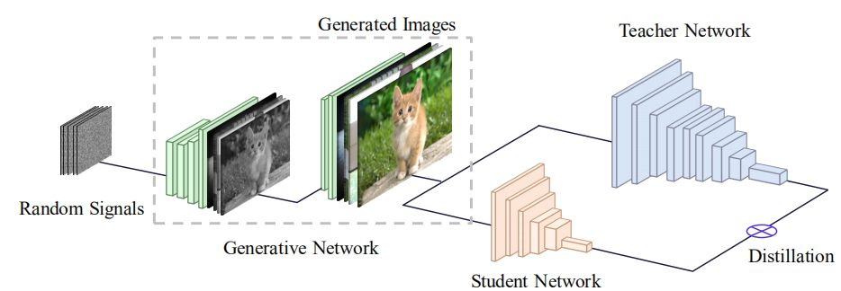

# Learn from Model: A suvery (paper list)

**Abstract**

> Large Pre-trained Models (LPMs) have demonstrated remarkable performance across a wide range of tasks (especially in the fields of natural language processing and computer vision), primarily attributed to their ability to comprehend instructions and access extensive, high-quality data. This not only showcases their current effectiveness but also sets a promising trajectory towards the development of artificial general intelligence. 
> Unfortunately, due to competitive reasons, the raw data of the model used for large model training are often inaccessible, so the use of end-to-end models for downstream tasks has become a new research trend, which we call **learn from model (LFM)** in this article. LFM focuses on the research, modification, and design of LPMs based on the only model interface, so as to better understand the model structure and weights (in a black box environment), and to generalize the model to downstream tasks. The study of LFM techniques can be broadly categorized into six major areas: model tuning, model distillation, model reuse, meta learning, model editing and model augmentation. Each category encompasses a repertoire of methods and strategies that aim to enhance the capabilities and performance of LPMs.
> This paper gives a comprehensive review of the current methods based on LPMs from the perspective of LFM, in order to help readers better understand the current research status and ideas. To conclude, we summarize the survey by highlighting several critical areas for future exploration and addressing open issues that require further attention from the research community. As the field of LFM continues to evolve, it is essential to explore new directions, tackle challenges, and collaborate to unlock the full potential of LPMs in the advancement of artificial intelligence. The relevant papers we investigated in this article can be accessed at https://github.com/ruthless-man/Awesome-Learn-from-Model.

## Model Tuning

### Weight Enginerring

#### Fine Tuning

- P.  Liu  et  al.   Pre-train,  prompt,  and  predict:  A  systematic  survey  of prompting  methods  in  natural  language  processing. ACM  Computing Surveys , 55(9):1–35, 2023.
- [[arXiv](https://arxiv.org/abs/2104.08691)] B.  Lester  et  al.    The  power  of  scale  for  parameter-efficient  prompt tuning. arXiv preprint arXiv:2104.08691 , 2021.
- B. Min et al.  Recent advances in natural language processing via large pre-trained language models: A survey. ACM Computing Surveys , 2021.
- N. Tajbakhsh et al.  Convolutional neural networks for medical image analysis:  Full  training  or  fine  tuning? IEEE  transactions  on  medical imaging , 35(5):1299–1312, 2016.
- E.  B.  Zaken  et  al.   Bitfit:  Simple  parameter-efficient  fine-tuning  for transformer-based  masked  language-models. CoRR ,  abs/2106.10199, 2021.
- M.  Wortsman  et  al. Robust  fine-tuning  of  zero-shot  models. In Proceedings  of  the  IEEE/CVF  Conference  on  Computer  Vision  and Pattern Recognition , pp. 7959–7971, 2022.
- A. Radford et al.  Improving language understanding by generative pretraining.  2018.
- [[arXiv](https://arxiv.org/abs/2008.03156)] A.  Aghajanyan  et  al.   Better  fine-tuning  by  reducing  representational collapse. arXiv preprint arXiv:2008.03156 , 2020.
- [[arXiv](https://arxiv.org/abs/2202.10054)] A. Kumar et al.  Fine-tuning can distort pretrained features and underperform out-of-distribution. arXiv preprint arXiv:2202.10054 , 2022.
- N. Ruiz et al.  Dreambooth: Fine tuning text-to-image diffusion models for subject-driven generation. In Proceedings of the IEEE/CVF Conference on Computer Vision and Pattern Recognition , pp. 22500–22510, 2023.
- C. Chen et al.   Deep learning on computational-resource-limited platforms: a survey. Mobile Information Systems , 2020:1–19, 2020.
- Y. Sun et al. Singular value fine-tuning: Few-shot segmentation requires few-parameters fine-tuning. Advances in Neural Information Processing Systems , 35:37484–37496, 2022.
- T. L. Hayes et al.  Remind your neural network to prevent catastrophic forgetting.  In European Conference on Computer Vision , pp. 466–483. Springer, 2020.
- Z.  Fu  et  al.   On  the  effectiveness  of  parameter-efficient  fine-tuning. In Proceedings  of  the  AAAI  Conference  on  Artificial  Intelligence , volume 37, pp. 12799–12807, 2023.
- [[arXiv](https://arxiv.org/abs/2301.12314)] A.  Razdaibiedina  et  al.   Progressive  prompts:  Continual  learning  for language models. arXiv preprint arXiv:2301.12314 , 2023.

### Adapter Tuning

- N.  Houlsby  et  al.    Parameter-efficient  transfer  learning  for  nlp.    In International Conference on Machine Learning , pp. 2790–2799. PMLR, 2019.
- N. Ding et al.  Parameter-efficient fine-tuning of large-scale pre-trained language models. Nature Machine Intelligence , 5(3):220–235, 2023.
- [[arXiv](https://arxiv.org/abs/2005.00247)] J. Pfeiffer et al.   Adapterfusion: Non-destructive task composition for transfer learning. arXiv preprint arXiv:2005.00247 , 2020.
- [[arXiv](https://arxiv.org/abs/2106.03164)] R. He et al.  On the effectiveness of adapter-based tuning for pretrained language model adaptation. arXiv preprint arXiv:2106.03164 , 2021.
- R. Karimi Mahabadi et al. Compacter: Efficient low-rank hypercomplex adapter  layers. In  M.  Ranzato  et  al.,  editors, Advances  in  Neural Information  Processing  Systems ,  volume  34,  pp.  1022–1035.  Curran Associates, Inc., 2021.
- [[arXiv](https://arxiv.org/abs/2106.01463)] H.  Le  et  al. Lightweight  adapter  tuning  for  multilingual  speech translation. arXiv preprint arXiv:2106.01463 , 2021.
- [[arXiv](https://arxiv.org/abs/2205.12410)] Y.  Wang  et  al.    Adamix:  Mixture-of-adapter  for  parameter-efficient tuning  of  large  language  models. arXiv  preprint  arXiv:2205.12410 , 2022.
- Z.-C. Chen et al.  Exploring efficient-tuning methods in self-supervised speech models.  In 2022 IEEE Spoken Language Technology Workshop (SLT) , pp. 1120–1127. IEEE, 2023.
- S.  Vander  Eeckt  and  H.  Van  Hamme.    Using  adapters  to  overcome catastrophic  forgetting  in  end-to-end  automatic  speech  recognition. In ICASSP  2023-2023  IEEE  International  Conference  on  Acoustics, Speech and Signal Processing (ICASSP) , pp. 1–5. IEEE, 2023.

## Input engineering

### Prompt Tuning

- [[Arxiv](https://arxiv.org/abs/2302.04237)] Adversarial Prompting for Black Box Foundation Models
  > 开发了一个框架，用于使用令牌空间投影运算符来查找对抗性提示。该算子将连续的单词嵌入空间与离散的令牌空间桥接起来，并能够使用黑盒攻击来找到对抗性提示。
  > 我们展示了我们的框架如何自动找到独立的或预先准备好的提示，这些提示会导致文本到图像模型输出特定的图像类。我们可以进一步找到排除与目标类相关的令牌的对抗性提示。
  > 我们的框架还可以找到改变非结构化文本生成的对抗性提示。例如，我们发现对抗性提示会鼓励积极情绪或增加生成文本中字母“q”的频率。
- Textual Few-Shot Classification For API-based Models
- :star: [[nature](https://www.nature.com/articles/s42256-023-00626-4)] Parameter-efficient fine-tuning of large-scale pre-trained language models
  > **Fine-tuning的进阶升级版（冻结99%以上的参数进行任务适配），旨在全面分析delta-tuning（增量微调，使模型自适应变得低成本）的最新进展**  
  1.delta-tuning可分为addition-based, specification-based and reparameterization-based methods.  
  2.基于大型PLM中低内在维度的知识，我们表明delta调优本质上是一种关于解空间或函数空间的子空间优化方法。讨论证明了现有delta调谐方法的设计是合理的，并解释了实验中的一些现象。  
  3.受深度学习和最优控制理论之间关系的启发，我们将delta调谐解释为PLM寻找最优控制器。我们提出了一个最优控制框架，该框架统一了不同的delta调整方法。我们的分析为delta调谐方法的新颖设计提供了理论参考。  
  实验设计部分评估了vanilla fine-tuning（FT）和四种代表性的delta微调方法，包括提示微调（PT）、前缀微调（PF）、LoRA（LR）和适配器（AP）。   
  **结论**：
  本分析的重点是PLM的参数有效方法，即delta调谐。我们首先描述了这个问题，并提供了一个分类来系统地调查德尔塔调谐的发展。在经验证据的束缚下，我们提出了两个框架，从优化和最优控制的角度对delta调谐进行理论讨论。我们的讨论为delta调谐方法的新设计提供了理论参考，并有望激发对PLM模型自适应的更深入理解。从经验上讲，我们在100多项NLP任务中进行了广泛的实验，以公平地评估和探索组合性质、规模的影响和德尔塔调整的可转移性。就性能而言，delta调优可能略微落后于或相当于对各种任务的微调，并且随着模型的扩展，差距会缩小；就效率而言，delta调优可以显著减少存储空间和内存使用，并加速反向传播。总之，德尔塔调谐在刺激大型PLM方面显示出相当大的潜力，我们希望该范式能够得到进一步的理论研究和实证实践。
  
  
- [[Arxiv](https://arxiv.org/abs/2304.03589)] On Efficient Training of Large-Scale Deep Learning Models: A Literature Review
  > 以数据为中心：包括数据集正则化、数据采样和以数据为中心的课程学习技术，可以显著降低数据样本的计算复杂度  
  以模型为中心：包括基础模块加速、压缩训练、模型初始化和以模型为中心的课程学习技术，其重点是通过减少参数计算和提供更好的初始化来加速训练  
  以优化为中心：包括学习率的选择、大批量的使用、有效目标的设计和模型平均技术，关注大规模模型的训练策略，提高模型的通用性  
  预算训练：包括在资源受限情况下的一些独特的加速方法，例如对总迭代的限制  
  以系统为中心：包括一些高效的分布式框架和开源库，为上述加速算法的实现提供足够的硬件支持
- [[Arxiv](https://arxiv.org/abs/2302.04863)] Knowledge is a Region in Weight Space for Fine-tuned Language Models 
  > **模型形成的权重空间有助于参数的寻找，深入了解了模型之间的关系，位于两个相似模型之间的模型可以获得两者的知识。**
- [[Arxiv](https://arxiv.org/abs/2101.00190)] Prefix-Tuning: Optimizing Continuous Prompts for Generation
  > **Adapter-tuning简单易用，插入可训练模块**  
  **Prefix-Tuning前缀调优：上游前缀控制一个下游LM，而下游LM保持不变，因此不同的前缀+相同LM可以实现多功能**  
  Lightweight fine-tuning：（1）removing parameters，（2）summation tuning （3）Adapter tuning
  
- [[paper](https://proceedings.mlr.press/v162/sun22e.html)] Black-Box Tuning for Language-Model-as-a-Service (BBTv1)
  > **连续prompt的无梯度实现，基于随机嵌入DFO**  
  本文为这种场景提供了一种解决方案（BBT），以在不访问模型参数和梯度的情况下完成通用语言理解任务，从而使大规模PTM能够更好地造福用户，也就是说结合parameter-efficient tuning和基于random embedding的非梯度优化算法，就使用推理API把下游任务做好的愿景。prompt的优化几乎是不耗费算力的，因此这一优化过程可以在任何终端设备进行，根本不需要GPU，所有算力需求集中在大模型服务端。此外，这种优化方式还解藕了优化过程和模型前向传播的复杂度，原本的梯度下降中，反向传播的时间和内存占用与模型前向传播成正比，随着模型越来越大，优化也变得越来越昂贵；而black-box tuning的优化过程本身不耗费什么时间和内存，且复杂度仅依赖于本征维度d的大小，与前向传播的复杂度无关。
  **有意义的观点：Aghajanyan等人（2021）的经验表明，预训练模型参数越多，其本征维度反而越小，大规模预训练隐含地压缩了下游NLP任务的内在维度。**
- [[paper](https://aclanthology.org/2022.emnlp-main.259/)] BBTv2: Towards a Gradient-Free Future with Large Language Models
  > **在过去工作（Black-Box Tuning, ICML 2022）的基础上提出了BBTv2，使用深层 prompt 代替原有的输入层 prompt，并提出一种基于分治的无梯度优化方法对其进行交替优化，在多个少样本学习任务上仅优化千分之三的参数取得了和全参数微调相仿的性能。**
- [[paper](https://dl.acm.org/doi/full/10.1145/3560815)] Pre-train, Prompt, and Predict: A Systematic Survey of Prompting Methods in Natural Language Processing
  > NLP中完全监督的范式发挥的作用越来越小，目光逐渐转向了大模型和微调，微调又开始被提示工程所代替
  - 1.基础的提示工程  
  - 2.答案提示  
  - 3.多提示学习  
  - 4.提示感知方法  
  http://pretrain.nlpedia.ai/  
  prompting 更加依赖先验，而 fine-tuning 更加依赖后验
- [[Arxiv](https://arxiv.org/abs/2302.09236)] Scalable Prompt Generation for Semi-supervised Learning with Language Models
> 
  研究半监督学习下的提示设计，第一个在SSL设置中完全消除人工参与设计多个提示符和语言表达器的人，并获得与使用手动提示符和语言表达器的SoTA方法相似甚至更好的性能
- [[Arxiv](https://arxiv.org/abs/2303.02909)] Dynamic Prompting: A Unified Framework for Prompt Tuning
  > 为了填补这一空白，我们提出了动态提示(dynamic prompting)：位置、长度和提示表示都可以针对不同的任务和实例进行动态优化，使用SuperGlue作为benchmark。
  prefixtuning (PFT) 和prompttuning (PT)，只调优不属于原始预训练模型的少数参数，以及稀疏调优只优化plm的偏差项。稀疏模块设计通过调整更少的参数，这些方法有时可以匹配传统的微调性能。  
  
  DP主要就是在输入x的前后都插入prompt  
  首先，设计网络来分割prompt，一部分放在x前面，一部分放在x后面  
  然后，设计合适的prompt长度  
  最后，设计合适的prompt表示词
- [[Arxiv](https://arxiv.org/abs/2302.08958)] Towards Unifying Medical Vision-and-Language
Pre-training via Soft Prompts
  > 提出了PTUnifier，使医学预训练模型能够兼容不同模式的输入
- [[Arxiv](https://arxiv.org/abs/2212.09257)] PromptBoosting: Black-Box Text Classification with Ten Forward Passes
  > **集成学习Boosting+Prompt，本文提出了PROMPTBOOSTING，首先建立小提示池,然后通过ADABOOST从这些提示中创建一组弱学习器并将它们集成在一起来实现优异的性能**
  针对黑盒模型的无梯度提示优化技巧存在一些问题，比如需要对LMs进行大量的查询，考虑到预训练LMs不断增长的规模和计算成本，这是非常低效的，并且可能导致较大的近似误差  
  > 
- [[Arxiv](https://arxiv.org/abs/2205.12548)] RLPrompt: Optimizing discrete text prompts with reinforcement learning
  > **基于强化学习的离散提示优化**
    训练一个parameter-efficient policy network
- [[Arxiv](https://arxiv.org/abs/2302.03668)] Hard prompts made easy: Gradient-based discrete optimization for prompt tuning and discovery
  > 提出一种基于梯度的优化方法，为文本到图像和文本到文本的应用生成鲁棒和灵活的硬文本提示。  
  >
  > 1. 作者提出一种通过高效的基于梯度的优化学习硬文本提示的简单方案，该方案改编自梯度重投影方案和针对量化网络的大规模离散优化文献  
  > 2. 所提出的方法在优化硬提示的过程中使用连续的"软"提示作为中间变量，从而实现了鲁棒的优化并促进了提示的探索和发现  
  > 3. 该方法被用于文本到图像和文本到文本的应用，学到的硬提示在图像生成和语言分类任务中都表现良好
  >
- [[Arxiv](https://arxiv.org/abs/2303.00690)] Rethinking Efficient Tuning Methods from a Unified Perspective
  >
  > 1. 推导了主流PETL(Parameter efficient transfer learning)方法的并行形式（提示，Adapter，Prefix），它降低了耦合程度，并促进了大型预训练模型的参数高效部署。
  > 2. 我们提出了一个统一的调优框架U-Tuning，它包含现有的PETL方法，并允许衍生新的方法。  
  > 3. 对迁移学习的全面研究证明了U-Tuning的通用性和强大性。 
  > 将PTEL分为了MHA Based Tuning（包含了Prefix tuning和Prompt tuning）和FFN Based Tuning（Adapter tuning），如下图所示
  > 
  U-tuning的设计遵循了冻结函数+可变部分的设计，因此可以延伸到多种适应性结构中去：  
  $\boldsymbol{x}^{\prime}=\mathrm{OP}(\boldsymbol{x})+\mathrm{U}-\text { Tuner }(\boldsymbol{x})$  
- [[Arxiv](https://arxiv.org/abs/2303.07320)] Model-tuning Via Prompts Makes NLP Models Adversarially Robust
> **通过提示调优来实现全模型的微调来增强对抗鲁棒性（词语替换攻击）**
  
- [[Arxiv](https://arxiv.org/abs/2303.06571)] Gradient-Regulated Meta-Prompt Learning for Generalizable Vision-Language Model
  > **多模态相关**
  引入了一种新的梯度调节元提示学习(GRAM)框架，该框架仅使用未标记的图像-文本预训练数据，在元学习范式中联合元学习有效的软提示初始化以更好地适应和轻量级梯度调节功能以实现强跨域泛化
- [[Arxiv](https://arxiv.org/abs/2303.08518)] UPRISE: Universal Prompt Retrieval for Improving Zero-Shot Evaluation
  > 设计了一个轻量级的通用检索器UPRISE，给定一个Zero-Shot任务输入，该检索器可以自动从预先构建的数据池中检索提示（看上去是硬提示），原理是冻结LLM，然后通过模型输出来反向梯度优化检索器，然后训练好的检索器可以根据输入x选择合适的prompt插入到x前面，再一起输入LLM。文章提出跨模型（小模型到大模型）和跨任务（已有任务到没见过的任务）两种标准进行实验分析（在小模型GPT-Neo-2.7B上进行训练调优，然后在BLOOM-7.1B，OPT-66B，GPT3-175B上进行测试）。
  
  
  Method部分介绍了数据标签的构建方法，总体任务划分为text completion和multiple-choice两种，然后介绍了检索器的结构，微调和推理的方法。
  
- [[Arxiv](https://arxiv.org/abs/2301.12314)] [**ICLR 2023**] Progressive Prompts: Continual Learning for Language Models
  > **思路：**
  在模型面对一连串任务的情况下，为每个任务单独设计训练一个Prompt,同时前面的任务的prompt也会结合进来，但是不会被训练，同时对于每一个任务训练prompt的时候，遵循的训练方法是训练的时候优化MLP，然后训练完之后，输入到下一个任务的prompt是$P_k^{\prime}$：
  $$P_k^{\prime}=\operatorname{MLP}\left(P_k\right)+P_k$$
  

## Model Distillation

- [[Arxiv](https://arxiv.org/abs/2112.15278)] Data-Free Knowledge Transfer: A Survey
  > **Data-Free Knowledge Transfer (DFKT)无数据知识迁移**  
  > 1. Data-Free Knowledge Distillation (DFKD) 无数据知识蒸馏：将训练数据集的原始信息提取并传递到一个压缩学生模型中，知识传递,仍处于同一个任务下  
  > - （1）噪声优化 
  > - （2）生成重建 
  > - （3）对抗探索  
  > 应用方向：量化剪枝，增量学习，模型攻击
  > 2. Source-(Data) Free Domain Adaptation (SFDA) 无数据领域自适应：通过目标数据查询和探索跨领域知识，两个模型的结构共享（就是参数不一样），面对不同的任务  
  实现方法：（1）自监督训练：伪标签聚类；伪标签过滤 （2）虚拟源知识转移：源印象；风格迁移  
  应用方向：语义分割，目标检测  
  > **未来研究方向**
  > 1. 更高效的数据重建  
  > 2. 适应性的知识迁移  
  > 3. 联合学习  
  > 4. Transformer or GNN
- [[Arxiv](https://arxiv.org/abs/1710.07535)] Data-free knowledge distillation for deep neural networks
  > 提出了一种新的基于知识蒸馏[8]的神经网络压缩策略，而无需访问原始数据，提出了多种不同的教师网络的激活记录策略用来重建原始数据集，然后用重建的数据集去训练学生网络  
  > 传统模型压缩：（1）权重量化 （2）网络修剪 （3）知识蒸馏  
  > 在MNIST和CelebA上进行实验分析
- [[Arxiv](https://arxiv.org/abs/2302.14290)] Learning to Retain while Acquiring: Combating Distribution-Shift in Adversarial Data-Free Knowledge Distillation
  > **GAN知识蒸馏 cvpr2023**
  > 对抗生成网络 + 知识蒸馏 = 无数据知识蒸馏  
  > 
  > 主要处理的问题就是在学生网络更新的过程中的分布偏移  
  > 1.提出了一种新的元学习启发的知识蒸馏中学生网络更新的策略，旨在保持学生在知识保留上的表现，同时从当前  分布的样本中获取知识。  
  > 2.策略在知识获取和知识保留之间强制执行隐式梯度对齐，也就是说提出的学生更新策略对这两个任务执行了一个  共同的梯度方向，减少了两个目标之间的干扰。  
  > 3.最后，本文通过在多个数据集上展示本文的方法与先前技术的广泛验证和比较来支持本文的假设。  
  > 
  > 
- [[Arxiv](https://arxiv.org/abs/2303.08559)] Large Language Model Is Not a Good Few-shot Information Extractor, but a Good Reranker for Hard Samples!
  >  **信息抽取领域的大小模型协同**
  > 问题：  
  > 1. 在少样本IE任务中，Large-LM是否真的优于Small-LM?  
  > 2. 更多的标注数据能否提高Large-LM和Small-LM?  
  > 3. LLMs和SLMs是否分别擅长处理不同类型的样本?  
  > 思路：将小模型不太确定的测试样本再给大模型重新选择一下  
  > 
- [[Arxiv](https://arxiv.org/abs/2303.07616)] The Life Cycle of Knowledge in Big Language Models: A Survey
  > 将预训练语言模型的知识生命周期划分为五个：  
  > **1.知识获取：关注模型怎么从文本中提取知识**
  > 建模方法有：因果建模，掩码建模，Seq2Seq建模，去噪建模
  > **2.知识表示：关注知识怎么转化为模型的底层参数**  
  > 分析方法有：基于梯度，基于因果，基于注意
  > **3.知识探索：评估当前包含不同类型知识的plm的效果。**  
  > **4.知识编辑：编辑或删除模型中的知识**  
  > 约束微调，内存微调，元学习微调
  > **5.知识应用：从训练好的模型中提取可用的知识**
- [[Arxiv](https://arxiv.org/abs/2212.05956)] Improving Generalization of Pre-trained Language Models via Stochastic Weight Averaging
  > **采用high constant learning rate下的随机加权平均(SWA)，一种鼓励收敛到更平坦的最小值的方法，以微调PLM，首次将SWA引入NLP领域**
  > SWA优点在于没有引入额外的计算成本，同时在紧凑型PLM的效果和SOTA KD方法相当
  > 
- [[Arxiv](https://arxiv.org/abs/2302.14771)] Feature Affinity Assisted Knowledge Distillation and Quantization of Deep Neural Networks on Label-Free Data
  > **设计了一种快速特征亲和损失（Fast Feature Affinity，FFA）用来提升知识蒸馏的效果**
  > **思路：**
  > 不仅是将老师和学生在输出层的标签进行匹配，同时还要将他们中间阶段的特征图进行匹配
- [[Arxiv](https://arxiv.org/abs/2302.14771)] Generic-to-Specific Distillation of Masked Autoencoders
  > **CVPR 2023**
  提出了通用到特定的蒸馏(G2SD)，将任务不可知和任务特定的知识从MAE转移到轻量级的vit，为两阶段视觉模型蒸馏设定了坚实的基线  
  实现方式：
  第一阶段：MAE教师解码器中间层的隐藏特征输出用于指导学生模型的训练。  
  第二阶段：对于特定任务的蒸馏，配备任务层的微调MAE向学生模型教授特定任务的知识(例如分类分数)。学生模型从前一个蒸馏阶段初始化，而任务层随机初始化。学生模型的预测被限制为与MAE的预测以及真实标签相一致。
  
- [[Arxiv](https://arxiv.org/abs/2306.02090)] Deep Classifier Mimicry without Data Access
  > - 提出了对比性演绎知识提取（Contrastive Abductive Knowledge Extraction，CAKE），这是一种不依赖于模型的知识蒸馏过程，无需访问原始数据。相反，通过对比性扩散过程生成合成样本，这些样本位于教师模型的决策边界附近。
  > - 通过实证研究强调了CAKE各组件的贡献，展示了教师和学生神经网络在深度和容量方面的差异，并分析了在教师和学生模型不同（MLP，CNN，ResNet和ViT）时CAKE的有效性。
  > - 与许多需要访问原始数据或依赖于复杂模型假设的“最先进”的方法相比，CAKE的分类准确性具有竞争力。
  > 

## Model Reuse

### Model Ensemble

- T. G. Dietterich.  Ensemble methods in machine learning.  In Multiple Classifier Systems , pp. 1–15, Berlin, Heidelberg, 2000. Springer Berlin Heidelberg.
- :star: [[Arxiv](https://arxiv.org/abs/2002.06715)] Y.  Wen  et  al.   BatchEnsemble:  An  Alternative  Approach  to  Efficient Ensemble and Lifelong Learning, February 2020.
  > 
- :star: [Arxviv](https://arxiv.org/abs/2307.08114) T. Y. Liu and S. Soatto.  Tangent Model Composition for Ensembling and Continual Fine-tuning, July 2023.
  > 

### Model fusion

### Weight Interpolation

- :star: J.  Frankle  et  al.    Linear  Mode  Connectivity  and  the  Lottery  Ticket Hypothesis, July 2020.
- D.  Yunis  et  al.   On  convexity  and  linear  mode  connectivity  in  neural networks.  In OPT 2022: Optimization for Machine Learning (NeurIPS 2022 Workshop) , 2022.
- :star: [ICML 2022][[Arxiv](http://arxiv.org/abs/2203.05482)] M. Wortsman et al.  Model soups: averaging weights of multiple finetuned  models  improves  accuracy  without  increasing  inference  time. In International  Conference  on  Machine  Learning ,  pp.  23965–23998. PMLR, 2022.

### Mode Connectivity and Loss landscape

- :star: J.  Frankle  et  al.    Linear  Mode  Connectivity  and  the  Lottery  Ticket Hypothesis, July 2020.
- D.  Yunis  et  al.   On  convexity  and  linear  mode  connectivity  in  neural networks.  In OPT 2022: Optimization for Machine Learning (NeurIPS 2022 Workshop) , 2022.
  

  <a href="https://arxiv.org/abs/2302.10879">KNN-Adapter: Efficient Domain Adaptation for Black-Box Language Models</a> 

 
<blockquote>

思路基于2019年的文章：https://arxiv.org/abs/1911.00172
k-Nearest将语言模型的输出与从目标域构建的数据存储中的topk最近匹配示例所做的预测相结合。这种组合允许模型在没有额外训练的情况下，通过将该领域的特定特征纳入其预测来适应新的目标领域。然而，检索增强域自适应的零样本特性常常导致有限的实用性，因为模型不是在目标域上训练的，而是仅基于在数据存储中可以找到的最近的示例来适应域。与在目标域上进行专门微调的模型相比，这可能会导致性能次优。  
**KNN-Adapter+LM**  
KNN-LM中插值系数和分布温度是固定的，本文的创新就在于通过学习根据要预测的令牌、当前上下文和从数据存储中检索到的邻居来调整两个关键参数，即插值系数$\lambda $和分布温度$t$，从而提高kNN-LM的域自适应性能。

</blockquote>

  <a href="https://arxiv.org/abs/2303.02151">Prompt, generate, then cache: Cascade of foundation models makes strong few-shot learners</a> 

**CVPR 2023**

提出一种基础模型的级联，以纳入来自不同预训练范式的多样化知识，从而更好地进行少样本学习。

融合了四个模型： 1.CLIP语言对比  2.DINO视觉对比  3.DALL-E图像生成  4.GPT3语言生成
CaFo：首先GPT-3生成文本输入用于提示CLIP，用DALL-E来生成更多可训练数据，并且引入了一个可学习的缓存模型来自适应地混合来自CLIP和DINO的预测，最终分类效果很好

  <a href="https://arxiv.org/abs/2302.14225">Weighted Sampling for Masked Language Modeling</a> 

 
<blockquote>

**提出了两种加权采样方法来缓解传统掩蔽语言建模中的频率偏差问题：频率加加权采样和动态加权采样，计算出来每个token的屏蔽概率。**  
**通过将加权采样应用于BERT，开发了一种新的PLM，即WSBERT。**
<!--  -->

</blockquote>

  <a href="https://arxiv.org/abs/2203.06904">Delta tuning: A comprehensive study of parameter efficient methods for pre-trained language models</a> 

 
<blockquote>

**内容和Parameter-efficient fine-tuning of large-scale pre-trained language models几乎相同**

</blockquote>

  <a href="https://arxiv.org/abs/2109.01134">Learning to Prompt for Vision-Language Models</a> 

 
<blockquote>

**研究Prompt在大型视觉-语言模型的应用，也是用自适应的上下文学习来提升对图片的分类精度。**
提供了两种实现来处理不同性质的任务:  
1.基于统一上下文，与所有类共享相同的上下文，并且在大多数类别上都能很好地工作，也就是unified context，不管样本是什么类别，其learnable context都是一样的。    
2.基于特定于类的上下文，每个类学习一组特定的上下文令牌，适合于一些细粒度的类别，class-specific context，每个类别都有自己特有的learnable context。  
损失使用交叉熵损失

</blockquote>

  <a href="https://direct.mit.edu/tacl/article/doi/10.1162/tacl_a_00324/96460">How Can We Know What Language Models Know?
</a> 

 
<blockquote>

**研究prompt工程**

论文提出了基于挖掘（mining-based）和基于释义（paraphrasing-based）的方法来自动生成高质量和多样化的prompt，以及集成方法来组合来自不同提示的答案，用以更准确地估计LM中包含的知识，主要使用的数据集是LAMA。
</blockquote>

  <a href="https://arxiv.org/abs/2302.04761">Toolformer: Language models can teach themselves to use tools</a> 

 
<blockquote>

**基于自监督生成标签的方式，让语言模型可以自己决定什么时候使用外部工具，使用什么外部工具，怎么使用外部工具。**

</blockquote>

  <a href="https://arxiv.org/abs/2306.02561">LLM-BLENDER: Ensembling Large Language Models with Pairwise Ranking and Generative Fusion</a> 

 
<blockquote>

**ACL 2023**

LLM-BLENDER=PAIRRANKER+GENFUSER（排序+聚合）

- PAIRRANKER：对N个LLM输出进行两两比较。对输入文本和一对候选标签进行联合编码，得到矩阵分值表，based on DeBERTa
- GENFUSER：聚合排名为前K的LLM输出，Based on Flan-T5-XL
- 引入了MixInstruct数据集（self-instruct格式，包含训练和测试集），用于测试集成型LLM

</blockquote>

## 检索增强（Retrieval Augmented）

  <a href="https://arxiv.org/abs/2301.12652">REPLUG: Retrieval-Augmented Black-Box Language Models</a> 

 
<blockquote>

**处理生成文本中的事实性错误**

以往的白盒检索增强中一般是冻结检索器，优化大模型，也就是让LM适应retriever。

**思路:** 本文提出了一种黑盒式的检索增强组件REPLUG，优化检索组件，冻结大模型，让retriever适应LM，然后使用了一个集成的框架，其实就是把多个检索到的文档分别和输入x结合送到LM中，得到的结果再用权重的方式集成，老套路了。用余弦相似度去提取和x最接近的文本，然后分别结合x输入LM，得到集成结果，根据KL散度来训练检索器。

损失函数（检索似然和语言模型似然之间的KL散度）：
$$\mathcal{L}=\frac{1}{|\mathcal{B}|} \sum_{x \in \mathcal{B}} K L\left(P_R(d \mid x) \| Q_{\mathrm{LM}}(d \mid x, y)\right)$$

</blockquote>

 :x: <a href="https://arxiv.org/abs/2302.07027">AdapterSoup: Weight Averaging to Improve Generalization of Pretrained Language Models</a> 

 
<blockquote>

</blockquote>

## 多模态模型（Multimodal Learning）

  <a href="https://arxiv.org/abs/2302.14045">Language is not all you need: Aligning perception with language model</a> 

 
<blockquote>

**语言不是你需要的全部：对齐感知与语言模型，主要是针对多模态大模型的研究**

github链接：https://github.com/microsoft/unilm  

作者在Web规模的多模态语料库中从头开始训练Kosmos-1，语料库的内容包含了任意交错的文本和图像、图像-标题对以及文本数据

没有任何梯度更新或微调的情况下，在广泛的任务中评估了各种设置，包括零次学习、少次学习和多模态思维链的提示。

实验结果表明，Kosmos-1在以下方面效果较好：  
（1）语言理解、生成，甚至是无OCR的NLP（直接输入文档图像）  
（2）感知-语言任务，包括多模态对话、图像说明、视觉问答  
（3）视觉任务，例如带有说明的图像识别（通过文本指令指定分类）

</blockquote>

  <a href="https://arxiv.org/abs/2302.07121">Universal Guidance for Diffusion Models</a> 

 
<blockquote>

**实现多模态的Guidance指令来控制Diffusion Models**

Guided Image Generation：采用冻结的预训练扩散模型作为基础模型，修改采样方法，利用引导函数$f$的反馈来引导图像生成。

</blockquote>

## 模型编辑（Model Editing）

  <a href="https://arxiv.org/abs/2212.04089">Editing Models with Task Arithmetic</a> 

 
<blockquote>

**基于任务向量算术的模型编辑（ICLR 2023）**  
从非常有趣的角度进行模型权重的修改，原理上比较清晰，论文主要的工作是一直在做实验验证这些观点  

提出一种用任务向量编辑预训练模型的新方法，任务向量是通过将预训练模型权重减去该模型在任务中微调后权重而产生的。任务向量上的算术运算，如取负和相加，使得用户可修改和组合预训练模型的行为，也可以用来创建新的模型，在多个任务或由类比关系连接的任务上有更好的性能。这种方法高效易用，可实现无需额外推理成本的模型编辑。

使用方法：（1）删除特定向量来降低本模型在某方面的能力   （2）添加其他模型的任务向量增强本模型某方面能力  （3）通过类比（平行四边形法则）的方式让模型获得新能力（即使没有该方向的数据）

</blockquote>

## 模型重用（Model Reuse）

 :x: <a href="https://ieeexplore.ieee.org/document/9949516">Nonlinear Multi-Model Reuse
</a> 

 
<blockquote>

</blockquote>

  <a href="https://arxiv.org/abs/2306.03900">Model Spider: Learning to Rank Pre-Trained Models Efficiently
</a> 

 
<blockquote>

**高效选择合适的预训练模型用于新任务的方法**

- 提出了一种新的模型蜘蛛方法来对任务和ptm进行标记，该方法能够在给定下游任务的模型动物园中高效准确地对ptm进行排序
- MODEL SPIDER学习在单独的任务训练集上对ptm进行标记和排序，并且在资源预算允许的情况下，它可以合并某些ptm的特定于任务的前向结果。

</blockquote>

 :x: <a href="https://arxiv.org/abs/2306.03828">Quick-Tune: Quickly Learning Which Pretrained Model to Finetune and How
</a> 

 
<blockquote>

**为新的数据集（新任务）选择一个准确的预训练模型及其最优超参数**

- 设计广泛的搜索空间：创建了一个涵盖常见微调策略的搜索空间，用于训练和评估模型与数据集组合。

- 创建大型元数据集：通过在搜索空间中训练和评估 20,000 个模型与数据集组合，我们生成了一个大型元数据集，用于元学习多保真度性能预测器。

- 元学习多保真度性能预测器：利用元数据集，我们训练了一个多保真度性能预测器，用于预测不同模型在不同数据集上的性能。

</blockquote>

## 知识探索（Knowledge Exploration）

  <a href="https://arxiv.org/abs/1909.01066">Language Models as Knowledge Bases?</a> 

 
<blockquote>

**EMNLP**

该篇文章想要探索的问题是，通过在大型的文本语料上进行预训练，语言模型是否已经（或是有潜力）学习到并存储下了一些事实知识（主体-关系-客体形式的三元组或是问题-答案对）？  

针对这个问题，本文首先定义了一种判断语言模型是否包含某种知识的方法。以Bert作为例子，对于某个三元组（小明，出生在，上海），本文首先将这一知识通过模板转换为自然语言的形式—小明出生在[MASK]，如果Bert能够成功的预测出被[MASK]掉的词语，那么我们就认为Bert掌握了这一知识。

为了对预训练模型所包含的知识进行探索，本文进一步以上述完形填空的形式，从一些现有的知识源中构建了四个用于知识探测的数据集

实验部分，本文分别对两个单向的语言模型fairseq-fconv和Transformer-XL以及两个双向的语言模型ELMo和BERT进行了实验测试，使用$precision@k(p@k)$来表示模型预测的前K个词中，命中正确答案的准确率。结果表明，BERT-LARGE已经可以较为精确的对知识进行预测，这初步回答了该篇论文所提出的问题，语言模型中已经包含了相当数量的知识。

本文是较早对语言模型中包含的事实知识进行正式、系统化探索的论文，提出了将语言模型作为知识库这一概念，并构建了LAMA数据集用于对模型存储知识的能力进行评估。
</blockquote>

  <a href="https://arxiv.org/abs/2210.07574">Is synthetic data from generative models ready for image recognition?</a> 

 
<blockquote>

**ICLR**
用于图像识别的生成数据：  
1.传统仿真流水线生成的生成数据集（从图形引擎合成3D模型或场景的2D渲染）  
2.Diffusion，GAN生成模型合成得到

从生成数据角度出发对于零样本分类，少样本分类和预训练数据合成三个角度开展了实验分析，工作量比较大  
结论：合成数据可以促进image recognition，合成数据在预训练方面甚至超过imagenet。  
局限性：受限于资源无法计算更大尺寸的图片大小
</blockquote>

  <a href="https://arxiv.org/abs/2301.11293">Understanding Finetuning for Factual Knowledge Extraction from Language Models</a> 

 
<blockquote>

**知识提取相关**

**工作**：聚焦提取事实知识的语言模型微调过程，发现微调可能对知识提取产生负面影响，并提出了两套当前最优方案1：model mixing（将一个微调模型与一个零射击或少射击模型进行混合） and 2：mixture finetuning with the LM’s pre-training task（知识提取任务与LM的原始预训练任务的混合），以助于弥补负面影响并提高性能。

**背景**：此前在LM的研究上有一种新的知识图（Knowledge Graph，KG）构建范式，在这种范式中，LMs可以作为一种简单有效的管道，将网络上的异构数据源转换为结构化的KG表示，但是存在频率冲击（Frequency Shock）和范围转移（Range Shift）几种问题。

</blockquote>

  <a href="https://arxiv.org/abs/2301.12810">Crawling The Internal Knowledge-Base of Language Models</a> 

 
<blockquote>
目的是获得一个可解释和透明的表示，使人类能够检查LM知道什么，不知道什么，为什么会犯某些错误，以及LM编码的偏见是什么。

**贡献：**
- 1.设计了一个从LM中提取知识图谱（KG）方法
- 2.基于Prompt的方法将任务分解为多个子任务

主要内容：
- 1.Relation Generation
- 2.Relation Paraphrasing
- 3.Object Generation
- 4.Learning to Output “Don’t Know”
- 5.Subject Paraphrasing
- 6.LMCRAWL

</blockquote>

## 相关综述（Related Survey）

  <a href="https://arxiv.org/abs/2302.07842">Augmented Language Models: a Survey</a> 

 
<blockquote>

**增强语言模型（ALM）**
LeCun参与的工作，系统归纳了语言模型的推理能力以及使用外部工具能力的工作（推理指将复杂任务分解为更简单的子任务，工具包括调用模块等），并指出这个方向有可能解决传统语言模型所面临的可解释性，一致性以及扩展性的问题。

- 观点1：大规模语言模型由于模型幻视等问题在大规模推广时受到限制，很多LLM的能力随着模型参数量增加到一定限度才会涌现，LLM的模型规模跟数据需求在很多情况下都是不符合实际的。

- 观点2：将ALM分为（1） Reason: 推理，将潜在复杂任务分解为简单子任务的能力，而这些子任务是语言模型可以自身解决或者调用其他工具解决。（2）Tool: 工具，语言模型通过规则或者特殊token调用外部模块的能力，包括检索外部信息的检索系统，或者可以调用机器手臂的工具等。（3）Act：行为，ALM调用的工具会对虚拟或者真实世界产生影响并观测到结果。

参照博客 https://zhuanlan.zhihu.com/p/611492200

</blockquote>

  <a href="https://arxiv.org/pdf/2006.05525.pdf">Knowledge distillation: A survey
</a> 

 
<blockquote>

**IJCV 2021**

知识蒸馏由知识类型，蒸馏算法，师生架构三部分组成

**根据使用到的知识阶段进行划分：**

- Response-Based Knowledge 只用最后一层logit
$$L_{\mathrm{Res} D}\left(p\left(z_t, T\right), p\left(z_s, T\right)\right)=\mathcal{L}_R\left(p\left(z_t, T\right), p\left(z_s, T\right)\right)$$

- Feature-Based Knowledge 还用到中间层特征
$$L_{F e a D}\left(f_t(x), f_s(x)\right)=\mathcal{L}_F\left(\Phi_t\left(f_t(x)\right), \Phi_s\left(f_s(x)\right)\right)$$

- Relation-Based Knowledge 基于关系的知识探索不同层或数据样本之间的关系
$$L_{\mathrm{RelD}}\left(F_t, F_s\right)=\mathcal{L}_{R^2}\left(\psi_t\left(t_i, t_j\right), \psi_s\left(s_i, s_j\right)\right)$$

**根据教师学生模型是否同步更新进行划分：**

- 离线蒸馏：先训练教师模型，然后离线训练学生模型
- 在线蒸馏：两个模型同时更新，不区分教师和学生模型
- 自我蒸馏：两个模型的架构完全一致，可以看成是学生自己学习

**根据蒸馏算法进行划分：**

- 对抗蒸馏
- 多教师蒸馏
- 跨通道蒸馏
- 图蒸馏
- 注意力蒸馏
- 无数据蒸馏
- 量化蒸馏
- 终生蒸馏
- 神经结构搜索蒸馏

**根据应用进行划分**
- CV
- NLP
- 语音识别
- 推荐系统

</blockquote>

## 模块化（Modularity）

  <a href="https://arxiv.org/abs/2302.11529">Modular Deep Learning
</a> 

 
<blockquote>

**关于模块化迁移学习的survey**

- 观点1：多任务微调中，来自不同任务的学习信号可能会相互负向干扰。
- 观点2：模块化深度学习通过将计算与路由分离，并在本地更新模块来实现正向迁移和系统性泛化；
- 观点3：该框架由自主参数高效模块组成，信息有条件地被路由到模块的子集，随后被聚合；
- 观点4：模块化还有其他用途，包括扩展语言模型、因果推理、程序归纳和强化学习中的规划；
- 观点5：模块化深度学习已经成功地部署在具体的应用中，如跨语言和跨模态的知识转移。

**总结:**  
模块化深度学习提供了一种很有前途的解决方案，可以开发出专门针对多个任务而没有负面干扰的模型，并且可以系统性泛化到非相同分布的任务。
</blockquote>

