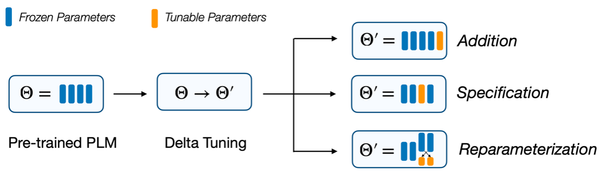
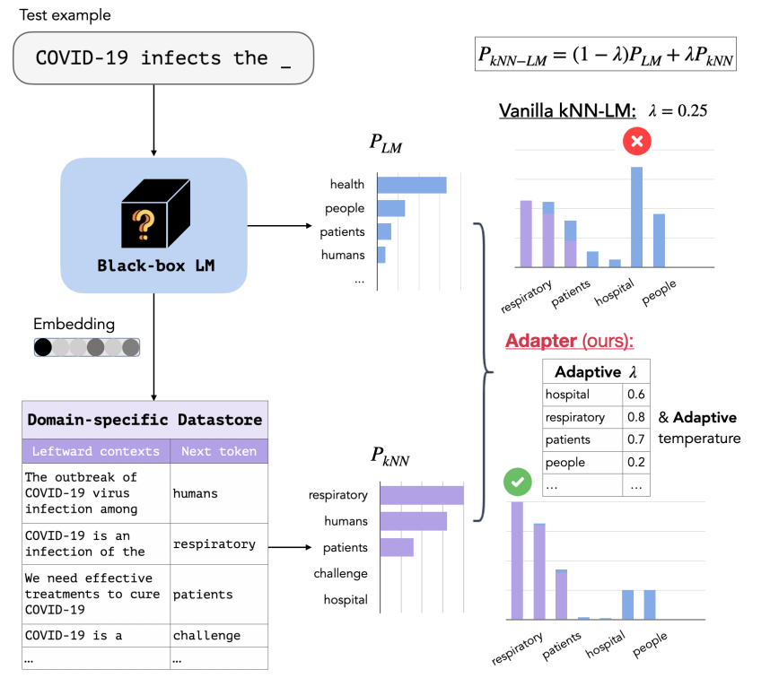
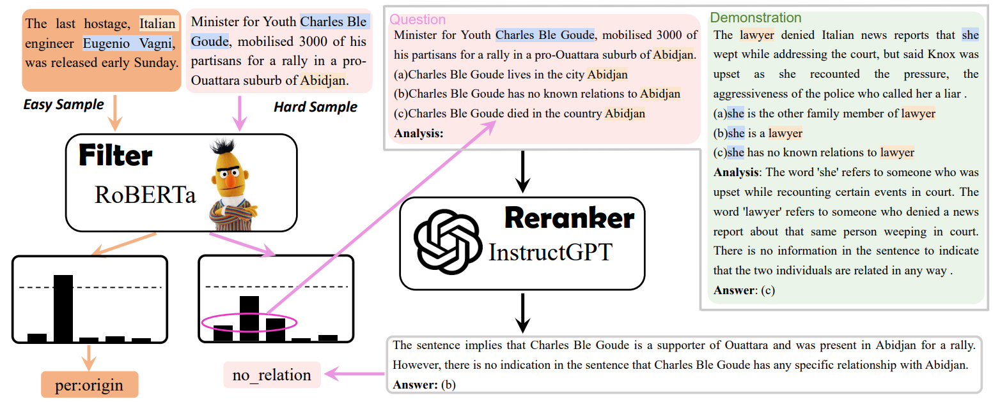

:white_check_mark: 已阅读
:x: 未阅读
⬜ 泛读

# 论文列表

## 模型攻击

 :white_check_mark: <a href="https://arxiv.org/abs/2004.15015">Imitation Attacks and Defenses for Black-box Machine Translation Systems</a> 

 :white_check_mark: <a href="https://openreview.net/forum?id=LoJ6oXzc_P3">STEALING AND DEFENDING TRANSFORMER-BASED ENCODERS</a> 

  

 ⬜ <a href="https://proceedings.neurips.cc/paper/2021/hash/50a074e6a8da4662ae0a29edde722179-Abstract.html">Variational model inversion attacks</a> 

 
<blockquote>

**NIPS 2021**
关注模型反演(MI)攻击，即只能访问训练过的分类器的情况下恢复训练集，这篇属于是白盒攻击  

1.将模型反演(MI)攻击问题看作是一个变分推理(VI)问题  
2.使用一组深度规范化流来实现框架  

</blockquote>

##

## 提示学习

 :white_check_mark: <a href="https://arxiv.org/abs/2302.04237" target="_blank">Adversarial Prompting for Black Box Foundation Models</a> 

 
<ul>
  <li>开发了一个框架，用于使用令牌空间投影运算符来查找对抗性提示。该算子将连续的单词嵌入空间与离散的令牌空间桥接起来，并能够使用黑盒攻击来找到对抗性提示。</li>
  <li>我们展示了我们的框架如何自动找到独立的或预先准备好的提示，这些提示会导致文本到图像模型输出特定的图像类。我们可以进一步找到排除与目标类相关的令牌的对抗性提示。</li>
  <li>我们的框架还可以找到改变非结构化文本生成的对抗性提示。例如，我们发现对抗性提示会鼓励积极情绪或增加生成文本中字母“q”的频率。</li>
</ul>

 :white_check_mark: 沈老师推荐Textual Few-Shot Classification For API-based Models 

 :white_check_mark: <a href="https://www.nature.com/articles/s42256-023-00626-4">Parameter-efficient fine-tuning of large-scale pre-trained language models</a> 

<blockquote>
 

**Fine-tuning的进阶升级版（冻结99%以上的参数进行任务适配），旨在全面分析delta-tuning（增量微调，使模型自适应变得低成本）的最新进展**  

1.delta-tuning可分为addition-based, specification-based and reparameterization-based methods.  
2.基于大型PLM中低内在维度的知识，我们表明delta调优本质上是一种关于解空间或函数空间的子空间优化方法。讨论证明了现有delta调谐方法的设计是合理的，并解释了实验中的一些现象。  
3.受深度学习和最优控制理论之间关系的启发，我们将delta调谐解释为PLM寻找最优控制器。我们提出了一个最优控制框架，该框架统一了不同的delta调整方法。我们的分析为delta调谐方法的新颖设计提供了理论参考。  

实验设计部分评估了vanilla fine-tuning（FT）和四种代表性的delta微调方法，包括提示微调（PT）、前缀微调（PF）、LoRA（LR）和适配器（AP）。   

**结论**：
本分析的重点是PLM的参数有效方法，即delta调谐。我们首先描述了这个问题，并提供了一个分类来系统地调查德尔塔调谐的发展。在经验证据的束缚下，我们提出了两个框架，从优化和最优控制的角度对delta调谐进行理论讨论。我们的讨论为delta调谐方法的新设计提供了理论参考，并有望激发对PLM模型自适应的更深入理解。从经验上讲，我们在100多项NLP任务中进行了广泛的实验，以公平地评估和探索组合性质、规模的影响和德尔塔调整的可转移性。就性能而言，delta调优可能略微落后于或相当于对各种任务的微调，并且随着模型的扩展，差距会缩小；就效率而言，delta调优可以显著减少存储空间和内存使用，并加速反向传播。总之，德尔塔调谐在刺激大型PLM方面显示出相当大的潜力，我们希望该范式能够得到进一步的理论研究和实证实践。

</blockquote>

 :white_check_mark: <a href="https://arxiv.org/abs/2303.02151">Prompt, generate, then cache: Cascade of foundation models makes strong few-shot learners</a> 

**CVPR 2023  CaFo提出一种基础模型的级联，以纳入来自不同预训练范式的多样化知识，从而更好地进行少样本学习。**
融合了四个模型： 1.CLIP语言对比  2.DINO视觉对比  3.DALL-E图像生成  4.GPT3语言生成
CaFo：首先GPT-3生成文本输入用于提示CLIP，用DALL-E来生成更多可训练数据，并且引入了一个可学习的缓存模型来自适应地混合来自CLIP和DINO的预测，最终分类效果很好

 :white_check_mark: <a href="https://arxiv.org/abs/2304.03589">On Efficient Training of Large-Scale Deep Learning Models: A Literature Review</a> 

 
<blockquote>
以数据为中心：包括数据集正则化、数据采样和以数据为中心的课程学习技术，可以显著降低数据样本的计算复杂度  
以模型为中心：包括基础模块加速、压缩训练、模型初始化和以模型为中心的课程学习技术，其重点是通过减少参数计算和提供更好的初始化来加速训练  
以优化为中心：包括学习率的选择、大批量的使用、有效目标的设计和模型平均技术，关注大规模模型的训练策略，提高模型的通用性  
预算训练：包括在资源受限情况下的一些独特的加速方法，例如对总迭代的限制  
以系统为中心：包括一些高效的分布式框架和开源库，为上述加速算法的实现提供足够的硬件支持
</blockquote>

 :white_check_mark: <a href="https://arxiv.org/abs/2302.04863">Knowledge is a Region in Weight Space for Fine-tuned Language Models</a> 

 
<blockquote>

**模型形成的权重空间有助于参数的寻找，深入了解了模型之间的关系，位于两个相似模型之间的模型可以获得两者的知识。**

</blockquote>

 :white_check_mark: <a href="https://arxiv.org/abs/2302.12822">Automatic Prompt Augmentation and Selection with Chain-of-Thought from Labeled Data</a> 

 
<blockquote>
思维链可参考博客：https://zhuanlan.zhihu.com/p/620776904
**思维链系列文章 此系列开山作品：Chain of thought prompting elicits reasoning in large language models（NIPS 2022）**
思维链是一系列的短句子，模仿了人类在回答问题时的思考和可能的推理过程。

第二篇工作Large Language Models are Zero-Shot Reasoners，这篇文章的发现很有趣

回到本篇：  
大多数 CoT 研究依赖于精心设计的人工注释理性链来提示语言模型，这对现实世界的应用提出了挑战。本文提出了一种新的策略Automate-CoT，它可以通过从一个小的标记数据集中自动增加理性链，然后修剪低质量的链来绕过人工标注思维链的过程。最后，它采用减少方差的策略梯度策略来估计语言模型中每个示例的重要性，从池中选择几个基本原理链的最佳组合用于形成思维链。  
核心内容：小型标注数据集 ——> 扩充推理链 ——> 删除低质推理链，构建候选池 ——> 选择示例组合 ——> 推理链提示  
实验结果：算术推理 (+2.7%)、常识推理 (+3.4%)、符号推理 (+3.2%) 和非推理任务(+2.5%)

</blockquote>

 :white_check_mark: <a href="https://arxiv.org/abs/2101.00190">Prefix-Tuning: Optimizing Continuous Prompts for Generation</a> 

 
<blockquote>

**Adapter-tuning简单易用，插入可训练模块**  
**Prefix-Tuning前缀调优：上游前缀控制一个下游LM，而下游LM保持不变，因此不同的前缀+相同LM可以实现多功能**  
Lightweight fine-tuning：（1）removing parameters，（2）summation tuning （3）Adapter tuning

</blockquote>

 :white_check_mark: <a href="https://proceedings.mlr.press/v162/sun22e.html">Black-Box Tuning for Language-Model-as-a-Service (BBTv1)</a> 

 
<blockquote>

**连续prompt的无梯度实现，基于随机嵌入DFO**  
本文为这种场景提供了一种解决方案（BBT），以在不访问模型参数和梯度的情况下完成通用语言理解任务，从而使大规模PTM能够更好地造福用户，也就是说结合parameter-efficient tuning和基于random embedding的非梯度优化算法，就使用推理API把下游任务做好的愿景。prompt的优化几乎是不耗费算力的，因此这一优化过程可以在任何终端设备进行，根本不需要GPU，所有算力需求集中在大模型服务端。此外，这种优化方式还解藕了优化过程和模型前向传播的复杂度，原本的梯度下降中，反向传播的时间和内存占用与模型前向传播成正比，随着模型越来越大，优化也变得越来越昂贵；而black-box tuning的优化过程本身不耗费什么时间和内存，且复杂度仅依赖于本征维度d的大小，与前向传播的复杂度无关。
**有意义的观点：Aghajanyan等人（2021）的经验表明，预训练模型参数越多，其本征维度反而越小，大规模预训练隐含地压缩了下游NLP任务的内在维度。**
</blockquote>

 :white_check_mark: <a href="https://aclanthology.org/2022.emnlp-main.259/">BBTv2: Towards a Gradient-Free Future with Large Language Models</a> 

 
<blockquote>

**在过去工作（Black-Box Tuning, ICML 2022）的基础上提出了BBTv2，使用深层 prompt 代替原有的输入层 prompt，并提出一种基于分治的无梯度优化方法对其进行交替优化，在多个少样本学习任务上仅优化千分之三的参数取得了和全参数微调相仿的性能。**
</blockquote>

 :white_check_mark: <a href="https://dl.acm.org/doi/full/10.1145/3560815">Pre-train, Prompt, and Predict: A Systematic Survey of Prompting Methods in Natural Language Processing</a> 

 
<blockquote>
NLP中完全监督的范式发挥的作用越来越小，目光逐渐转向了大模型和微调，微调又开始被提示工程所代替
1.基础的提示工程  
2.答案提示  
3.多提示学习  
4.提示感知方法  
http://pretrain.nlpedia.ai/  

prompting 更加依赖先验，而 fine-tuning 更加依赖后验

</blockquote>

 ⬜ <a href="https://arxiv.org/abs/2302.09236">Scalable Prompt Generation for Semi-supervised Learning with Language Models</a> 

 
<blockquote>

研究半监督学习下的提示设计，第一个在SSL设置中完全消除人工参与设计多个提示符和语言表达器的人，并获得与使用手动提示符和语言表达器的SoTA方法相似甚至更好的性能

</blockquote>

 :x: <a href="https://arxiv.org/abs/2303.02909">Dynamic Prompting: A Unified Framework for Prompt Tuning</a> 

 
<blockquote>

</blockquote>

 :white_check_mark: <a href="https://arxiv.org/abs/2302.08958">Towards Unifying Medical Vision-and-Language
Pre-training via Soft Prompts</a> 

 
<blockquote>
提出了PTUnifier，使医学预训练模型能够兼容不同模式的输入
</blockquote>

 :x: <a href="https://arxiv.org/abs/2302.07121">Universal Guidance for Diffusion Models</a> 

 
<blockquote>

</blockquote>

 :x: <a href="https://arxiv.org/abs/2303.02151">Prompt, generate, then cache: Cascade of foundation models makes strong few-shot learners</a> 

 
<blockquote>

</blockquote>

 :white_check_mark: <a href="https://arxiv.org/abs/2212.09257">PromptBoosting: Black-Box Text Classification with Ten Forward Passes</a> 

 
<blockquote>

**集成学习Boosting+Prompt，本文提出了PROMPTBOOSTING，首先建立小提示池,然后通过ADABOOST从这些提示中创建一组弱学习器并将它们集成在一起来实现优异的性能**

针对黑盒模型的无梯度提示优化技巧存在一些问题，比如需要对LMs进行大量的查询，考虑到预训练LMs不断增长的规模和计算成本，这是非常低效的，并且可能导致较大的近似误差  

</blockquote>

 ⬜ <a href="https://arxiv.org/abs/2205.12548">RLPrompt: Optimizing discrete text prompts with reinforcement learning</a> 

 
<blockquote>

**基于强化学习的离散提示优化**
训练一个parameter-efficient policy network
</blockquote>

 ⬜ <a href="https://arxiv.org/abs/2302.03668">Hard prompts made easy: Gradient-based discrete optimization for prompt tuning and discovery</a> 

 
<blockquote>
提出一种基于梯度的优化方法，为文本到图像和文本到文本的应用生成鲁棒和灵活的硬文本提示。

1.作者提出一种通过高效的基于梯度的优化学习硬文本提示的简单方案，该方案改编自梯度重投影方案和针对量化网络的大规模离散优化文献  
2.所提出的方法在优化硬提示的过程中使用连续的"软"提示作为中间变量，从而实现了鲁棒的优化并促进了提示的探索和发现  
3.该方法被用于文本到图像和文本到文本的应用，学到的硬提示在图像生成和语言分类任务中都表现良好  
</blockquote>

 :x: <a href="https://arxiv.org/abs/2303.00690">Rethinking Efficient Tuning Methods from a Unified Perspective</a> 

 
<blockquote>

</blockquote>

 :x: <a href="https://arxiv.org/abs/2303.07320">Model-tuning Via Prompts Makes NLP Models Adversarially Robust</a> 

 
<blockquote>
</blockquote>

 :x: <a href="https://arxiv.org/abs/2303.06571">Gradient-Regulated Meta-Prompt Learning for Generalizable Vision-Language Models</a> 

 
<blockquote>
</blockquote>

 :x: <a href="https://arxiv.org/abs/2303.08518">UPRISE: Universal Prompt Retrieval for Improving Zero-Shot Evaluation</a> 

 
<blockquote>
</blockquote>

##

## 模型融合

 :white_check_mark: <a href="https://arxiv.org/abs/2302.10879">KNN-Adapter: Efficient Domain Adaptation for Black-Box Language Models</a> 

 
<blockquote>

思路基于2019年的文章：https://arxiv.org/abs/1911.00172
k-Nearest将语言模型的输出与从目标域构建的数据存储中的topk最近匹配示例所做的预测相结合。这种组合允许模型在没有额外训练的情况下，通过将该领域的特定特征纳入其预测来适应新的目标领域。然而，检索增强域自适应的零样本特性常常导致有限的实用性，因为模型不是在目标域上训练的，而是仅基于在数据存储中可以找到的最近的示例来适应域。与在目标域上进行专门微调的模型相比，这可能会导致性能次优。  
**KNN-Adapter+LM**  
KNN-LM中插值系数和分布温度是固定的，本文的创新就在于通过学习根据要预测的令牌、当前上下文和从数据存储中检索到的邻居来调整两个关键参数，即插值系数$\lambda $和分布温度$t$，从而提高kNN-LM的域自适应性能。

</blockquote>

 :white_check_mark: <a href="https://arxiv.org/abs/2302.14225">Weighted Sampling for Masked Language Modeling</a> 

 
<blockquote>

**提出了两种加权采样方法来缓解传统掩蔽语言建模中的频率偏差问题：频率加加权采样和动态加权采样，计算出来每个token的屏蔽概率。**  
**通过将加权采样应用于BERT，开发了一种新的PLM，即WSBERT。**
<!--  -->

</blockquote>

 :white_check_mark: <a href="https://arxiv.org/abs/2203.06904">Delta tuning: A comprehensive study of parameter efficient methods for pre-trained language models</a> 

 
<blockquote>

**内容和Parameter-efficient fine-tuning of large-scale pre-trained language models几乎相同**

</blockquote>

 :white_check_mark: <a href="https://arxiv.org/abs/2109.01134">Learning to Prompt for Vision-Language Models</a> 

 
<blockquote>

**研究Prompt在大型视觉-语言模型的应用，也是用自适应的上下文学习来提升对图片的分类精度。**
提供了两种实现来处理不同性质的任务:  
1.基于统一上下文，与所有类共享相同的上下文，并且在大多数类别上都能很好地工作，也就是unified context，不管样本是什么类别，其learnable context都是一样的。    
2.基于特定于类的上下文，每个类学习一组特定的上下文令牌，适合于一些细粒度的类别，class-specific context，每个类别都有自己特有的learnable context。  
损失使用交叉熵损失

</blockquote>

 ⬜ <a href="https://direct.mit.edu/tacl/article/doi/10.1162/tacl_a_00324/96460">How Can We Know What Language Models Know?
</a> 

 
<blockquote>

**研究prompt工程**

论文提出了基于挖掘（mining-based）和基于释义（paraphrasing-based）的方法来自动生成高质量和多样化的prompt，以及集成方法来组合来自不同提示的答案，用以更准确地估计LM中包含的知识，主要使用的数据集是LAMA。
</blockquote>

 :white_check_mark: <a href="https://arxiv.org/abs/2302.04761">Toolformer: Language models can teach themselves to use tools</a> 

 
<blockquote>

**基于自监督生成标签的方式，让语言模型可以自己决定什么时候使用外部工具，使用什么外部工具，怎么使用外部工具。**

</blockquote>

##
## 模型蒸馏

 :white_check_mark: <a href="https://arxiv.org/abs/2112.15278">Data-Free Knowledge Transfer: A Survey</a> 

 
<blockquote>

**Data-Free Knowledge Transfer (DFKT)无数据知识迁移**  
1.Data-Free Knowledge Distillation (DFKD) 无数据知识蒸馏：将训练数据集的原始信息提取并传递到一个压缩学生模型中，知识传递,仍处于同一个任务下  
（1）噪声优化 （2）生成重建 （3）对抗探索  
应用方向：量化剪枝，增量学习，模型攻击
2.Source-(Data) Free Domain Adaptation (SFDA) 无数据领域自适应：通过目标数据查询和探索跨领域知识，两个模型的结构共享（就是参数不一样），面对不同的任务  
实现方法：（1）自监督训练：伪标签聚类；伪标签过滤 （2）虚拟源知识转移：源印象；风格迁移  
应用方向：语义分割，目标检测  

**未来研究方向**
1.更高效的数据重建  
2.适应性的知识迁移  
3.联合学习  
4.Transformer or GNN

</blockquote>

 :white_check_mark: <a href="https://arxiv.org/abs/1710.07535">Data-free knowledge distillation for deep neural networks</a> 

 
<blockquote>
提出了一种新的基于知识蒸馏[8]的神经网络压缩策略，而无需访问原始数据，提出了多种不同的教师网络的激活记录策略用来重建原始数据集，然后用重建的数据集去训练学生网络  
传统模型压缩：（1）权重量化 （2）网络修剪 （3）知识蒸馏  
在MNIST和CelebA上进行实验分析
</blockquote>

 :white_check_mark: <a href="https://arxiv.org/abs/2210.07574">Is synthetic data from generative models ready for image recognition?</a> 

 
<blockquote>

**ICLR**
用于图像识别的生成数据：  
1.传统仿真流水线生成的生成数据集（从图形引擎合成3D模型或场景的2D渲染）  
2.Diffusion，GAN生成模型合成得到

从生成数据角度出发对于零样本分类，少样本分类和预训练数据合成三个角度开展了实验分析，工作量大  
结论：合成数据可以促进image recognition，合成数据在预训练方面甚至超过imagenet。  
局限性：受限于资源无法计算更大尺寸的图片大小
</blockquote>

 :white_check_mark: <a href="https://arxiv.org/abs/2302.14290">Learning to Retain while Acquiring: Combating Distribution-Shift in Adversarial Data-Free Knowledge Distillation</a> 

 
<blockquote>

**GAN知识蒸馏 cvpr2023**

对抗生成网络 + 知识蒸馏 = 无数据知识蒸馏  

主要处理的问题就是在学生网络更新的过程中的分布偏移  
1.提出了一种新的元学习启发的知识蒸馏中学生网络更新的策略，旨在保持学生在知识保留上的表现，同时从当前分布的样本中获取知识。  
2.策略在知识获取和知识保留之间强制执行隐式梯度对齐，也就是说提出的学生更新策略对这两个任务执行了一个共同的梯度方向，减少了两个目标之间的干扰。  
3.最后，本文通过在多个数据集上展示本文的方法与先前技术的广泛验证和比较来支持本文的假设。  

</blockquote>

 :white_check_mark: <a href="https://arxiv.org/abs/2303.08559">Large Language Model Is Not a Good Few-shot Information Extractor,
but a Good Reranker for Hard Samples!</a> 

 
<blockquote>

**信息抽取领域的大小模型协同**
问题：  
（1）在少样本IE任务中，Large-LM是否真的优于Small-LM?  
（2）更多的标注数据能否提高Large-LM和Small-LM?  
（3）LLMs和SLMs是否分别擅长处理不同类型的样本?  

思路：将小模型不太确定的测试样本再给大模型重新选择一下  

</blockquote>

 :white_check_mark: <a href="https://arxiv.org/abs/2303.07616">The Life Cycle of Knowledge in Big Language Models: A Survey
</a> 

 
<blockquote>

将预训练语言模型的知识生命周期划分为五个：  
**1.知识获取：关注模型怎么从文本中提取知识**
建模方法有：因果建模，掩码建模，Seq2Seq建模，去噪建模
**2.知识表示：关注知识怎么转化为模型的底层参数**  
分析方法有：基于梯度，基于因果，基于注意
**3.知识探索：评估当前包含不同类型知识的plm的效果。**  
**4.知识编辑：编辑或删除模型中的知识**  
约束微调，内存微调，元学习微调
**5.知识应用：从训练好的模型中提取可用的知识**

</blockquote>

 :white_check_mark: <a href="https://arxiv.org/abs/2302.14771">Generic-to-Specific Distillation of Masked Autoencoders

</a> 

 
<blockquote>

**CVPR 2023**
提出了通用到特定的蒸馏(G2SD)，将任务不可知和任务特定的知识从MAE转移到轻量级的vit，为两阶段视觉模型蒸馏设定了坚实的基线  
实现方式：
第一阶段：MAE教师解码器中间层的隐藏特征输出用于指导学生模型的训练。  
第二阶段：对于特定任务的蒸馏，配备任务层的微调MAE向学生模型教授特定任务的知识(例如分类分数)。学生模型从前一个蒸馏阶段初始化，而任务层随机初始化。学生模型的预测被限制为与MAE的预测以及真实标签相一致。

</blockquote>

##

## 多模态大模型

 :white_check_mark: <a href="https://arxiv.org/abs/2302.14045">Language is not all you need: Aligning perception with language model</a> 

 
<blockquote>

**语言不是你需要的全部：对齐感知与语言模型，主要是针对多模态大模型的研究**
github链接：https://github.com/microsoft/unilm  

作者在Web规模的多模态语料库中从头开始训练Kosmos-1，语料库的内容包含了任意交错的文本和图像、图像-标题对以及文本数据

没有任何梯度更新或微调的情况下，在广泛的任务中评估了各种设置，包括零次学习、少次学习和多模态思维链的提示。

实验结果表明，Kosmos-1在以下方面效果较好：  
（1）语言理解、生成，甚至是无OCR的NLP（直接输入文档图像）  
（2）感知-语言任务，包括多模态对话、图像说明、视觉问答  
（3）视觉任务，例如带有说明的图像识别（通过文本指令指定分类）

</blockquote>

##
## 模型编辑

 :white_check_mark: <a href="https://arxiv.org/abs/2212.04089">Editing Models with Task Arithmetic</a> 

 
<blockquote>

**基于任务向量算术的模型编辑（ICLR 2023）**  
从非常有趣的角度进行模型权重的修改，原理上比较清晰，论文主要的工作是一直在做实验验证这些观点  

提出一种用任务向量编辑预训练模型的新方法，任务向量是通过将预训练模型权重减去该模型在任务中微调后权重而产生的。任务向量上的算术运算，如取负和相加，使得用户可修改和组合预训练模型的行为，也可以用来创建新的模型，在多个任务或由类比关系连接的任务上有更好的性能。这种方法高效易用，可实现无需额外推理成本的模型编辑。

使用方法：（1）删除特定向量来降低本模型在某方面的能力   （2）添加其他模型的任务向量增强本模型某方面能力  （3）通过类比（平行四边形法则）的方式让模型获得新能力（即使没有该方向的数据）

</blockquote>

##
## 神经崩塌（Neural Collapse）

 :white_check_mark: <a href="https://arxiv.org/abs/2203.09081">Inducing Neural Collapse in Imbalanced Learning: Do We Really Need a Learnable Classifier at the End of Deep Neural Network?</a> 

 
<blockquote>

分析了神经崩塌问题，提出了一种全新的框架，把可训练线性分类器修改为一个训练过程中保持不变的随机初始化的 ETF simplex，训练过程中最后一层 classifier 不再需要 push 梯度，只需要 pull 梯度，同时证明了一个更好的收敛性质。

</blockquote>

 ⬜ <a href="https://www.researchgate.net/publication/348927984_Layer-Peeled_Model_Toward_Understanding_Well-Trained_Deep_Neural_Networks#:~:text=In%20this%20paper%2C%20we%20introduce%20the%20Layer-Peeled%20Model%2Ca,suggests%2C%20this%20new%20model%20is%20derived%20by%20isolating">Layer-Peeled Model: Toward Understanding Well-Trained Deep Neural Networks</a> 

 
<blockquote>
分层模型：理解训练有素的深度神经网络

</blockquote>

##
## 零阶

 :x: <a href="https://arxiv.org/abs/2203.14195">How to robustify black-box ml models? a zeroth-order optimization perspective</a> 

 
<blockquote>

</blockquote>

##
## 数理基础

 :x: <a href="https://www.csie.ntu.edu.tw/~b97058/tseng/papers/archive/bcr_jota.pdf">Convergence of a block coordinate descent method for nondifferentiable minimization</a> 

 
<blockquote>

</blockquote>

##

## 待分类

 :white_check_mark: <a href="https://arxiv.org/abs/1909.01066">Language Models as Knowledge Bases?</a> 

 
<blockquote>

**EMNLP**
该篇文章想要探索的问题是，通过在大型的文本语料上进行预训练，语言模型是否已经（或是有潜力）学习到并存储下了一些事实知识（主体-关系-客体形式的三元组或是问题-答案对）？  

针对这个问题，本文首先定义了一种判断语言模型是否包含某种知识的方法。以Bert作为例子，对于某个三元组（小明，出生在，上海），本文首先将这一知识通过模板转换为自然语言的形式—小明出生在[MASK]，如果Bert能够成功的预测出被[MASK]掉的词语，那么我们就认为Bert掌握了这一知识。

为了对预训练模型所包含的知识进行探索，本文进一步以上述完形填空的形式，从一些现有的知识源中构建了四个用于知识探测的数据集

实验部分，本文分别对两个单向的语言模型fairseq-fconv和Transformer-XL以及两个双向的语言模型ELMo和BERT进行了实验测试，使用$precision@k(p@k)$来表示模型预测的前K个词中，命中正确答案的准确率。结果表明，BERT-LARGE已经可以较为精确的对知识进行预测，这初步回答了该篇论文所提出的问题，语言模型中已经包含了相当数量的知识。

本文是较早对语言模型中包含的事实知识进行正式、系统化探索的论文，提出了将语言模型作为知识库这一概念，并构建了LAMA数据集用于对模型存储知识的能力进行评估。
</blockquote>

Training-free Lexical Backdoor Attacks on Language Models

Augmented Language Models: a Survey

Understanding Finetuning for Factual Knowledge Extraction from Language Models

Feature Affinity Assisted Knowledge Distillation and Quantization of Deep Neural Networks on Label-Free Data

Modular Deep Learning

REPLUG: Retrieval-Augmented Black-Box Language Models

Crawling the Internal Knowledge-Base of Language Models

Improving Generalization of Pre-trained Language Models via Stochastic Weight Averaging

Active Prompting with Chain-of-Thought for Large Language Models

Progressive Prompts: Continual Learning for Language Models

Causally Disentangled Generative Variational AutoEncoder

Out-of-Domain Robustness via Targeted Augmentations

Aligning Text-to-Image Models using Human Feedback

Exponential Hardness of Reinforcement Learning with Linear Function Approximation

Digital twin aided adversarial transfer learning method for domain adaptation fault diagnosis

Git re-basin: Merging models modulo permutation symmetries

