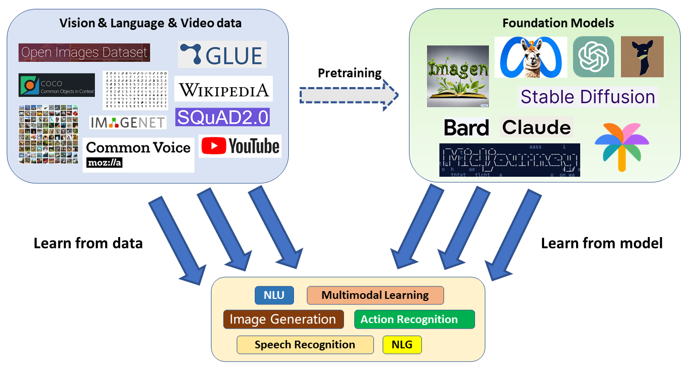
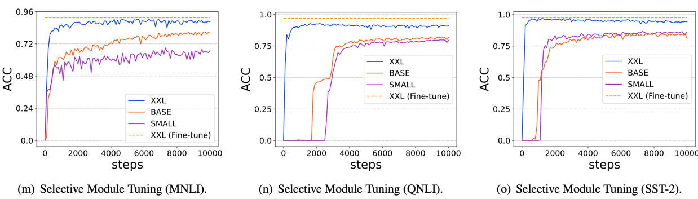
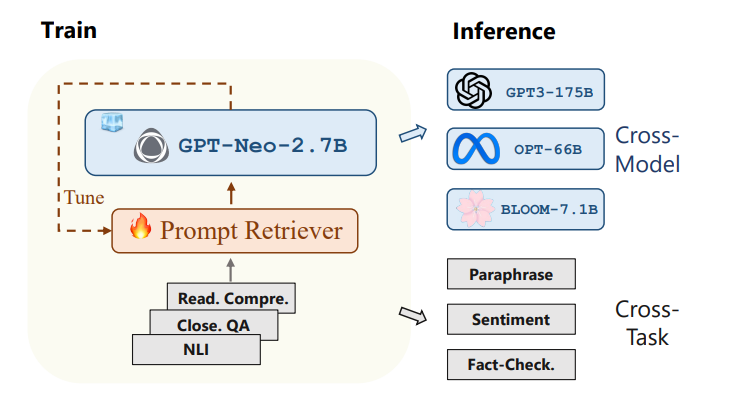
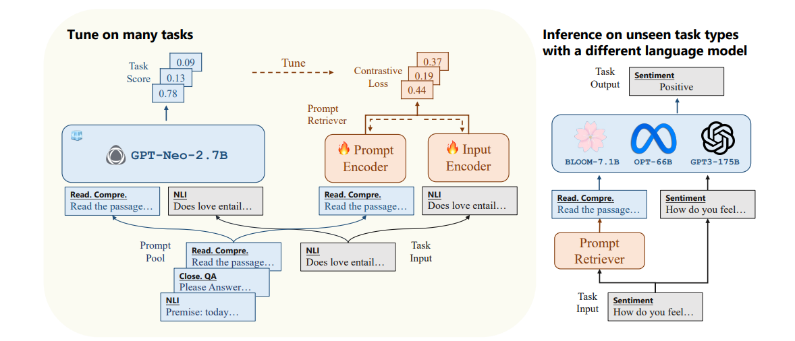

# Learn From Model Beyond Fine-Tuning


### 🎉 **Exciting News (2024.11): Our Paper Has Been Accepted By Nature Machine Intelligence!** 

We are thrilled to share that our paper has been accepted for publication! It is an exciting milestone, and we want to thank everyone involved for their hard work and support. Looking forward to seeing our research contribute to the field. Please check out our survey paper https://arxiv.org/abs/2310.08184

>


<!-- ## Abstract

> Large Pre-trained Models (LPMs) have demonstrated remarkable performance across a wide range of tasks (especially in the fields of natural language processing and computer vision), primarily attributed to their ability to comprehend instructions and access extensive, high-quality data. This not only showcases their current effectiveness but also sets a promising trajectory towards the development of artificial general intelligence.
> Unfortunately, due to competitive reasons, the raw data of the model used for large model training are often inaccessible, so the use of end-to-end models for downstream tasks has become a new research trend, which we call **learn from model (LFM)** in this article. LFM focuses on the research, modification, and design of LPMs based on the only model interface, so as to better understand the model structure and weights (in a black box environment), and to generalize the model to downstream tasks. The study of LFM techniques can be broadly categorized into six major areas: model tuning, model distillation, model reuse, meta learning, model editing and model augmentation. Each category encompasses a repertoire of methods and strategies that aim to enhance the capabilities and performance of LPMs.
> This paper gives a comprehensive review of the current methods based on LPMs from the perspective of LFM, in order to help readers better understand the current research status and ideas. To conclude, we summarize the survey by highlighting several critical areas for future exploration and addressing open issues that require further attention from the research community. As the field of LFM continues to evolve, it is essential to explore new directions, tackle challenges, and collaborate to unlock the full potential of LPMs in the advancement of artificial intelligence. The relevant papers we investigated in this article can be accessed at https://github.com/ruthless-man/Awesome-Learn-from-Model. -->


## Table of Contents
- [Learn From Model Beyond Fine-Tuning: A Survey](#learn-from-model-beyond-fine-tuning-a-survey)
  - [Table of Contents](#table-of-contents)
  - [Papers](#Papers)
    - [Model Tuning](#model-tuning)
      - [Weight Enginerring](#Weight-Enginerring)
          - [Fine Tuning](#Fine-Tuning)
          - [Adapter Tuning](#Adapter-Tuning)
      - [Input engineering](#Input-engineering)
        - [Prompt Tuning](#Prompt-Tuning)
        - [InstructioN Tuning](#InstructioN-Tuning)
      - [Database Augmentation](#Database-Augmentation)
        - [Language Database Augmentation](#Language-Database-Augmentation)
        - [Multimodal Database Augmentation](#Multimodal-Database-Augmentation)
    - [Model Distillation](#Model-Distillation)
      - [Noise Optimization](#Noise-Optimization)
      - [Generative Reconstruction](#Generative-Reconstruction)
      - [Adversarial Exploration](#Adversarial-Exploration)
    - [Model Reuse](#Model-Reuse)
      - [Model Ensemble](#Model-Ensemble)
      - [Model fusion](#Model-Fusion)
        - [Weight Interpolation](#Weight-Interpolation)
        - [Mode Connectivity Based Method](#Mode-Connectivity-Based-Method)
        - [Straightforward Optimization](#Straightforward-Optimization)
    - [Meta Learning](#Meta-Learning)
      - [White-box Data-free Meta-learning](#White-box-Data-free-Meta-learning)
      - [Black-box Data-free Meta-learning](#Black-box-Data-free-Meta-learning)
    - [Model Editing](#Model-Editing)
      - [Memory Based Model Editing](#Memory-Based-Model-Editing)
      - [Parameter Based Model Editing](#Parameter-Based-Model-Editing) 
        - [Constrained Tuning](#Constrained-Tuning)
        - [Locate And Edit](#Locate-And-Edit)
        - [Meta Learning](#Meta-Learning)    
  - [Citation](#citation)

## Papers


## Model Tuning


### Weight Enginerring

#### Fine Tuning

- [[mikecaptain](https://www.mikecaptain.com/resources/pdf/GPT-1.pdf)] Improving language understanding by generative pretraining

- [[arXiv](https://arxiv.org/abs/2008.03156)] Better fine-tuning by reducing representational collapse

- [[ACM Computing Surveys](https://dl.acm.org/doi/full/10.1145/3560815)] Pre-train,  prompt,  and  predict:  A  systematic survey of prompting  methods in  natural  language  processing

- [[arXiv](https://arxiv.org/abs/2104.08691)] The  power  of  scale  for  parameter-efficient  prompt tuning

- [[ACM Computing Surveys](https://dl.acm.org/doi/abs/10.1145/3605943)] Recent advances in natural language processing via large pre-trained language models: A survey


- [[TMI](https://ieeexplore.ieee.org/abstract/document/7426826)] Convolutional neural networks for medical image analysis: Full training or fine  tuning? IEEE transactions on medical imaging


- [[ACL](https://aclanthology.org/2022.acl-short.1/)] Bitfit:  Simple  parameter-efficient  fine-tuning  for transformer-based  masked  language-models


- [[CVPR](https://openaccess.thecvf.com/content/CVPR2022/html/Wortsman_Robust_Fine-Tuning_of_Zero-Shot_Models_CVPR_2022_paper.html?ref=roboflow-blog)] Robust  fine-tuning  of  zero-shot  models 


- [[arXiv](https://arxiv.org/abs/2008.03156)] Better fine-tuning by reducing representational collapse

- [[arXiv](https://arxiv.org/abs/2202.10054)] Fine-tuning can distort pretrained features and underperform out-of-distribution 

- [[CVPR](https://openaccess.thecvf.com/content/CVPR2023/html/Ruiz_DreamBooth_Fine_Tuning_Text-to-Image_Diffusion_Models_for_Subject-Driven_Generation_CVPR_2023_paper.html)] Dreambooth: Fine tuning text-to-image diffusion models for subject-driven generation

- [[arXiv](https://arxiv.org/abs/2302.04863)] Knowledge is a Region in Weight Space for Fine-tuned Language Models 
  <!-- >  - **The weight space formed by the model helps to find the parameters, and the relationship between the models is deeply understood. The model located between two similar models can obtain the knowledge of both.** -->

- [[Nips](https://proceedings.neurips.cc/paper_files/paper/2022/hash/f3bfbd65743e60c685a3845bd61ce15f-Abstract-Conference.html)] Singular value fine-tuning: Few-shot segmentation requires few-parameters fine-tuning

- [[AAAI](https://arxiv.org/abs/2202.10054)] On the effectiveness of parameter-efficient fine-tuning

- :star: [[nature](https://www.nature.com/articles/s42256-023-00626-4)] Parameter-efficient fine-tuning of large-scale pre-trained language models
  <!-- > **Fine-tuning的进阶升级版（冻结99%以上的参数进行任务适配），旨在全面分析delta-tuning（增量微调，使模型自适应变得低成本）的最新进展**  
  >delta-tuning可分为addition-based, specification-based and reparameterization-based methods.  
  >基于大型PLM中低内在维度的知识，我们表明delta调优本质上是一种关于解空间或函数空间的子空间优化方法。讨论证明了现有delta调谐方法的设计是合理的，并解释了实验中的一些现象。  
  >受深度学习和最优控制理论之间关系的启发，我们将delta调谐解释为PLM寻找最优控制器。我们提出了一个最优控制框架，该框架统一了不同的delta调整方法。我们的分析为delta调谐方法的新颖设计提供了理论参考。实验设计部分评估了vanilla fine-tuning（FT）和四种代表性的delta微调方法，包括提示微调（PT）、前缀微调（PF）、LoRA（LR）和适配器（AP）。    -->
    <!-- >
    > -->

#### Adapter Tuning

- [[arXiv](https://arxiv.org/abs/2106.01463)] Lightweight adapter tuning for multilingual speech translation

- [[arXiv](https://arxiv.org/abs/2211.03831)] Multi-head adapter routing for cross-task generalization

- [[arXiv](https://arxiv.org/abs/2205.12410)] Adamix: Mixture-of-adapter for parameter-efficient tuning of large language models


- [[arXiv](https://arxiv.org/abs/2304.01933)] Llm-adapters: An adapter family for parameter-efficient fine-tuning of large language models


- [[arXiv](https://arxiv.org/abs/2005.00247)] Adapterfusion: Non-destructive task composition for transfer learning

- [[arXiv](https://arxiv.org/abs/2106.03164)] On the effectiveness of adapter-based tuning for pretrained language model adaptation


- [[arXiv](https://arxiv.org/abs/2205.12410)] Adamix:  Mixture-of-adapter  for  parameter-efficient tuning  of  large  language  models

- [[SLT](https://ieeexplore.ieee.org/abstract/document/10023274)] Exploring efficient-tuning methods in self-supervised speech models

- [[ICASSP]( https://ieeexplore.ieee.org/abstract/document/10095837)]  Using  adapters  to  overcome catastrophic  forgetting  in  end-to-end  automatic  speech  recognition

### Input engineering

#### Prompt Tuning

- [[arXiv](https://arxiv.org/abs/2109.01134)] Learning to Prompt for Vision-Language Model

  <!-- > -  **To study the application of Prompt in large visual-language model, adaptive context learning is also used to improve the accuracy of picture classification.**  
  > - Based on a unified context that shares the same context with all classes and works well on most classes, i.e. unified context, the learnable context is the same regardless of the class the sample is in.  
  > - Each class learns a specific set of context tokens, based on its class-specific context, for some fine-grained class, class-specific context, each of which has its own learnable context. -->
  <!-- > -->

- [[arXiv](https://arxiv.org/abs/2101.00190)] Prefix-tuning: Optimizing continuous prompts for generation


- [[ICLR](https://arxiv.org/abs/2301.12314)] Progressive prompts: Continual learning for language models

- [[arXiv](https://arxiv.org/abs/2205.12548)] Rlprompt: Optimizing discrete text prompts with reinforcement learning
  <!-- > **Discrete cue optimization based on reinforcement learning: Training a parameter-efficient policy network** -->

- [[ICML](https://proceedings.mlr.press/v162/sun22e.html)] Black-Box Tuning for Language-Model-as-a-Service (BBTv1)
  <!-- >  - **Gradientless implementation of continuous prompt, based on random embedded DFO**   -->
  <!-- > -  This article provides a solution, called Black-Box Tuning (BBT), for this scenario to accomplish general language understanding tasks without accessing model parameters and gradients. It enables large-scale Pre-Trained Models (PTMs) to better benefit users by combining parameter-efficient tuning and non-gradient optimization algorithms based on random embedding. The vision is to use inference APIs to excel in downstream tasks. The optimization of prompts is almost computationally inexpensive, allowing this optimization process to be performed on any endpoint device without the need for GPUs. All computational requirements are concentrated on the large-scale model server. Furthermore, this optimization approach decouples the complexity of the optimization process from the model's forward propagation. In the conventional gradient descent method, the time and memory consumption of backpropagation are directly proportional to the forward propagation of the model, making optimization more expensive as models grow larger. In contrast, the optimization process of black-box tuning itself consumes minimal time and memory, with complexity dependent only on the intrinsic dimensionality d, independent of forward propagation complexity. -->


- [[EMNLP](https://aclanthology.org/2022.emnlp-main.259/)] BBTv2: Towards a gradient-free future with large language models

  <!-- > -  **Building upon our previous work on Black-Box Tuning (BBT, ICML 2022), we propose BBTv2, which introduces deep prompts as a replacement for the original input layer prompt. We also present a divide-and-conquer non-gradient optimization method to iteratively optimize the deep prompts. Remarkably, by optimizing only 0.3% of the parameters, we achieve performance comparable to full parameter fine-tuning on multiple few-shot learning tasks.** -->

  
- [[arXiv](https://arxiv.org/abs/2303.06571)] Gradient-regulated meta-prompt learning for generalizable vision-language models

- [[arXiv](https://arxiv.org/abs/2302.04237)] Adversarial Prompting for Black Box Foundation Models
  <!-- > - Developing a framework that utilizes token space projection operators to discover adversarial prompts. This operator bridges the continuous word embedding space with the discrete token space and is capable of using black-box attacks to find adversarial prompts.  
  > - Demonstrating how our framework automatically discovers independent or pre-designed prompts that result in specific image classes being outputted by a text-to-image model. Furthermore, we can find adversarial prompts that exclude tokens related to the target class.  
  > - Our framework can also discover adversarial prompts that alter the generation of unstructured text. For instance, we found that adversarial prompts encourage positive emotions or increase the frequency of the letter "q" in the generated text. -->

- [[ACM Computing Surveys](https://dl.acm.org/doi/full/10.1145/3560815)] Pre-train, Prompt, and Predict: A Systematic Survey of Prompting Methods in Natural Language Processing
  <!-- > NLP中完全监督的范式发挥的作用越来越小，目光逐渐转向了大模型和微调，微调又开始被提示工程所代替
  >
  > 基础的提示工程  
  > 答案提示  
  > 多提示学习  
  > 提示感知方法  
  > http://pretrain.nlpedia.ai/  
  > prompting 更加依赖先验，而 fine-tuning 更加依赖后验 -->

- [[arXiv](https://arxiv.org/abs/2302.09236)] Scalable Prompt Generation for Semi-supervised Learning with Language Models

  <!-- > - Investigate prompt design under semi-supervised learning, the first to completely eliminate human involvement in designing multiple prompts and language expressors in an SSL setup, and achieve similar or even better performance than SoTA methods using manual prompts and language expressors -->
  >  


- [[arXiv](https://arxiv.org/abs/2303.02909)] Dynamic Prompting: A Unified Framework for Prompt Tuning
  <!-- >  - To fill this gap, we propose dynamic prompting: position, length, and prompt representation can all be dynamically optimized for different tasks and instances, using SuperGlue as the benchmark. -->
  >


- [[arXiv](https://arxiv.org/abs/2302.08958)] Towards Unifying Medical Vision-and-Language Pre-training via Soft Prompts
  <!-- > -  The PTUnifier is proposed to make the medical pretraining model compatible with different input modes -->


- [[ICML](https://arxiv.org/abs/2212.09257)] PromptBoosting: Black-Box Text Classification with Ten Forward Passes
  <!-- > -  **Ensemble learning Boosting+Prompt, this paper proposes PROMPTBOOSTING, which first builds a pool of small prompts, and then through ADABOOST creates a set of weak learners from these prompts and integrates them together to achieve excellent performance**
  > - Gradient-free cueing optimization techniques for black-box models have some problems, such as requiring a large number of queries on the LMs, which is very inefficient given the growing size and computational cost of pre-trained LMs, and can lead to large approximation errors
  > -->


- [[Arxiv](https://arxiv.org/abs/2304.03589)] On Efficient Training of Large-Scale Deep Learning Models: A Literature Review
  <!-- > - Data-Centric Approaches: These include techniques such as data set regularization, data sampling, and data-centric curriculum learning, which can significantly reduce the computational complexity of data samples.  
  > - Model-Centric Approaches: These encompass methods like accelerating basic modules, training compression, model initialization, and model-centric curriculum learning. The focus here is on accelerating training by reducing parameter computation and providing better initialization.  
  > - Optimization-Centric Approaches: These involve strategies such as learning rate selection, utilizing large batches, designing effective objectives, and model averaging techniques. They concentrate on training strategies for large-scale models to enhance their generalizability.  
  > - Budgeted Training: This involves unique acceleration methods under resource-constrained scenarios, such as restrictions on the total number of iterations.  
  > - System-Centric Approaches: These include efficient distributed frameworks and open-source libraries that provide sufficient hardware support for implementing the aforementioned acceleration algorithms. -->
- [[arXiv](https://arxiv.org/abs/2302.03668)] Hard prompts made easy: Gradient-based discrete optimization for prompt tuning and discovery
  <!-- > - A gradient-based optimization method is proposed to generate robust and flexible hard text prompts for text-to-image and text-to-text applications.  
  > - We propose a simple scheme for learning hard text prompts through efficient gradient-based optimization, adapted from gradient reprojection schemes and large-scale discrete optimization literature for quantization networks.    
  > - The proposed method uses continuous "soft" prompts as intermediate variables in the process of optimizing hard prompts, thus achieving robust optimization and facilitating prompt exploration and discovery.  
  > - The method is used for text-to-image and text-to-text applications, and the hard tips learned perform well in both image generation and language classification tasks. -->


- [[arXiv](https://arxiv.org/abs/2303.00690)] Rethinking Efficient Tuning Methods from a Unified Perspective
  <!-- > -  The parallel form (prompt, Adapter, Prefix) of the mainstream Parameter efficient transfer learning (PETL) method is derived, which reduces the coupling degree and promotes the parameter efficient deployment of large pre-trained models.  
  >  - We propose a unified tuning framework, U-Tuning, which contains existing PETL methods and allows new methods to be derived.  
  >  - The comprehensive research on transfer learning proves the versatility and power of U-Tuning.  
  >  - PTEL is divided into MHA Based Tuning (including Prefix tuning and Prompt tuning) and FFN Based Tuning (Adapter tuning), as shown in the following figure.  
  
  > - The U-tuning design follows the freeze function + variable part design, so it can be extended to a variety of adaptive structures:  
  > $$\boldsymbol{x}^{\prime}=\mathrm{OP}(\boldsymbol{x})+\mathrm{U}-\text { Tuner }(\boldsymbol{x})$$ -->


- [[arXiv](https://arxiv.org/abs/2303.07320)] Model-tuning Via Prompts Makes NLP Models Adversarially Robust
  <!-- >-  **Fine-tuning of the entire model through prompt tuning for increased robustness against (word substitution attacks)** -->
  


- [[arXiv](https://arxiv.org/abs/2303.08518)] UPRISE: Universal Prompt Retrieval for Improving Zero-Shot Evaluation
  <!-- > - The article describes the design of a lightweight universal retriever called UPRISE. Given a zero-shot task input, the retriever automatically retrieves prompts from a pre-constructed data pool, which appear to be hard prompts. The approach involves freezing the language model (LLM) and performing gradient-based optimization on the retriever using the model's outputs. The trained retriever can then select an appropriate prompt to insert in front of the input x, which is then fed into the LLM.  
  > - The paper presents experimental analyses based on two criteria: cross-model (from small-scale models like GPT-Neo-2.7B to large-scale models like BLOOM-7.1B, OPT-66B, and GPT3-175B) and cross-task (from previously seen tasks to unseen tasks). The training and fine-tuning of the retriever are conducted on the small-scale model GPT-Neo-2.7B, while the testing is performed on the larger-scale models mentioned above.
  
  
  > - The Method part introduces the construction method of data tags, the overall task is divided into text completion and multiple-choice, and then introduces the structure, fine tuning and inference method of the retrieval device.
   -->


- [[CVPR](https://arxiv.org/abs/2303.02151)] Prompt, generate, then cache: Cascade of foundation models makes strong few-shot learners

  <!-- > -  Propose a cascade of base models to incorporate diverse knowledge from different pre-training paradigms for better small-sample learning.  
  >  - CaFo: First GPT-3 generates text input to prompt CLIP, DALL-E is used to generate more trainable data, and a learnable cache model is introduced to adaptively mix predictions from CLIP and DINO, resulting in good classification. -->


#### Instruction Tuning


- [[COLING](https://arxiv.org/abs/2209.09900)] Linguist: Language model instruction tuning to generate annotated utterances for intent classification and slot tagging

- [[arXiv](https://arxiv.org/abs/2304.08485)] Visual Instruction Tuning


- [[arXiv](https://arxiv.org/abs/2307.03601)] Gpt4roi: Instruction tuning large language model on region-of-interest


- [[ICML](https://arxiv.org/abs/2301.13688)] The flan collection: Designing data and methods for effective instruction tuning


- [[arXiv](https://arxiv.org/abs/2304.03277)] Instruction tuning with gpt-4


- [[Nips](https://proceedings.neurips.cc/paper_files/paper/2022/hash/b1efde53be364a73914f58805a001731-Abstract-Conference.html)] Training language models to follow instructions with human feedback

- [[arXiv](https://arxiv.org/abs/2302.03202)] Exploring the benefits of training expert language models over instruction tuning

- [[arXiv](https://arxiv.org/abs/2305.03726)] Otter: A Multi-Modal Model with In-Context Instruction Tuning


## Database Augmentation


- [[arXiv](https://arxiv.org/abs/2302.07842)] Augmented Language Models: a Survey

  <!-- > **Enhanced Language Model (ALM)**
  > - This paper summarizes the inference ability of language models and the work on the ability to use external tools (inference refers to the decomposition of complex tasks into simpler subtasks, tools include calling modules, etc.), and points out that this direction may solve the problems of interpretability, consistency, and extensibility faced by traditional language models.  
  > - Viewpoint 1: Large-scale language models are limited in large-scale promotion due to problems such as model vision. Many LLM capabilities will emerge only when the number of model parameters increases to a certain limit. The model scale and data requirements of LLM are unrealistic in many cases.  
  > - Viewpoint 2: Divide ALM into (1) Reason: inference, the ability to break down potentially complex tasks into simple subtasks that the language model can solve on its own or by invoking other tools. (2) Tool: The ability of the language model to call external modules through rules or special tokens, including a retrieval system to retrieve external information, or a tool that can call the robot arm. (3) Act: Actions, tools invoked by ALM will have an impact on the virtual or real world and observe the results.   -->


### Language Database Augmentation


- [[arXiv](https://arxiv.org/abs/1612.04426)] Improving neural language models with a continuous cache


- [[arXiv](https://arxiv.org/abs/1911.00172)] Generalization through memorization: Nearest neighbor language models


- [[Nips](https://proceedings.neurips.cc/paper/2020/hash/6b493230205f780e1bc26945df7481e5-Abstract.html)] Retrieval-augmented generation for knowledge-intensive nlp tasks 


- [[arXiv](https://arxiv.org/abs/2208.03299)] Few-shot learning with retrieval augmented language models


- [[arXiv](https://arxiv.org/abs/2301.12652)] Replug: Retrieval-augmented black-box language models

  <!-- **Handle factual errors in generated text** -->

  <!-- > **In the past, the white box search enhancement is generally freezing the retriever and optimizing the large model, that is, making the LM adapt to the retriever.**
  > -  **IDEA:** This paper proposes a black box search enhancement component REPLUG, optimize the search component, freeze the large model, let retriever adapt to LM, and then use an integrated framework, in fact, is to combine multiple retrieved documents and input x to LM, the results are integrated with weights, the old routine. Cosine similarity is used to extract the text that is closest to x, and then LM is input with x respectively to obtain the integrated result, and the retrieval is trained according to KL divergence.
    >
    > -->

  > -  Loss function (retrieves KL divergence between likelihood and language model likelihood) :
  >  $$\mathcal{L}=\frac{1}{|\mathcal{B}|} \sum_{x \in \mathcal{B}} K L\left(P_R(d \mid x) \| Q_{\mathrm{LM}}(d \mid x, y)\right)$$


### Multimodal Database Augmentation


- [[arXiv](https://arxiv.org/abs/2210.02928)] Murag: Multimodal retrieval-augmented generator for open question answering over images and text


- [[arXiv](https://arxiv.org/abs/2209.14491)] Re-Imagen: Retrieval-Augmented Text-to-Image Generator


- [[openreview](https://openreview.net/forum?id=VZ8bs0fwoO)] Retrieval-Augmented Multimodal Language Modeling

- [[arXiv](https://arxiv.org/abs/2202.01110)] A Survey on Retrieval-Augmented Text Generation


## Model Distillation
### Noise Optimization
-  [[IJCV](https://arxiv.org/pdf/2006.05525.pdf)] Knowledge distillation: A survey

    <!-- > - Knowledge distillation consists of three parts: knowledge type, distillation algorithm and teacher-student structure.
    <!-- > -->
    <!-- > -->
<!-- 
    > **According to whether the teacher-student model is updated synchronously:** 
    > -  Offline distillation: First train the teacher model, then train the student model offline.  
    > -  Online distillation: Both models are updated simultaneously, without distinguishing between teacher and student models.  
    > - Self-distillation: The architecture of the two models is exactly the same, and it can be seen as the student's own learning.   -->


- [[arXiv](https://arxiv.org/abs/2112.15278)] Data-Free Knowledge Transfer: A Survey
  <!-- > **Data-Free Knowledge Transfer (DFKT)**   -->
  <!-- > 1. Data-Free Knowledge Distillation (DFKD) 无数据知识蒸馏：将训练数据集的原始信息提取并传递到一个压缩学生模型中，知识传递,仍处于同一个任务下  
  > - （1）噪声优化 
  > - （2）生成重建 
  > - （3）对抗探索  
  > 应用方向：量化剪枝，增量学习，模型攻击
  > 2. Source-(Data) Free Domain Adaptation (SFDA) 无数据领域自适应：通过目标数据查询和探索跨领域知识，两个模型的结构共享（就是参数不一样），面对不同的任务  
  实现方法：（1）自监督训练：伪标签聚类；伪标签过滤 （2）虚拟源知识转移：源印象；风格迁移  
  应用方向：语义分割，目标检测  
  > **未来研究方向**
  > 1. 更高效的数据重建  
  > 2. 适应性的知识迁移  
  > 3. 联合学习  
  > 4. Transformer or GNN -->

### Generative Reconstruction
- [[arXiv](https://arxiv.org/abs/1710.07535)] Data-free knowledge distillation for deep neural networks
  <!-- > 提出了一种新的基于知识蒸馏[8]的神经网络压缩策略，而无需访问原始数据，提出了多种不同的教师网络的激活记录策略用来重建原始数据集，然后用重建的数据集去训练学生网络  
  > 传统模型压缩：（1）权重量化 （2）网络修剪 （3）知识蒸馏  
  > 在MNIST和CelebA上进行实验分析 -->

- [[CVPR](https://arxiv.org/abs/2302.14290)] Learning to Retain while Acquiring: Combating Distribution-Shift in Adversarial Data-Free Knowledge Distillation
   <!-- >    -->
  <!-- > -  The main problem dealt with is the distribution deviation in the process of student network updating.  
  > -  A novel meta-learning-inspired knowledge distillation strategy for secondary student network renewal is proposed, aiming to maintain student performance on knowledge retention while acquiring knowledge from currently distributed samples.  
  > - The strategy enforces an implicit gradient alignment between knowledge acquisition and knowledge retention, that is, the proposed student renewal strategy implements a common gradient direction for the two tasks, reducing the interference between the two goals.  
  >  -  Finally, this paper supports the hypothesis of this paper by showing extensive validation and comparison of our method with previous techniques on multiple data sets. -->
     > 

- [[arXiv](https://arxiv.org/abs/2303.08559)] Large Language Model Is Not a Good Few-shot Information Extractor, but a Good Reranker for Hard Samples!
  <!-- >  **信息抽取领域的大小模型协同**
  > 问题：  
  > 1. 在少样本IE任务中，Large-LM是否真的优于Small-LM?  
  > 2. 更多的标注数据能否提高Large-LM和Small-LM?  
  > 3. LLMs和SLMs是否分别擅长处理不同类型的样本?  
  > 思路：将小模型不太确定的测试样本再给大模型重新选择一下   -->
  <!-- >  -->

- [[arXiv](https://arxiv.org/abs/2303.07616)] The Life Cycle of Knowledge in Big Language Models: A Survey
  <!-- > 将预训练语言模型的知识生命周期划分为五个：  
  > **1.知识获取：关注模型怎么从文本中提取知识**
  > 建模方法有：因果建模，掩码建模，Seq2Seq建模，去噪建模
  > **2.知识表示：关注知识怎么转化为模型的底层参数**  
  > 分析方法有：基于梯度，基于因果，基于注意
  > **3.知识探索：评估当前包含不同类型知识的plm的效果。**  
  > **4.知识编辑：编辑或删除模型中的知识**  
  > 约束微调，内存微调，元学习微调
  > **5.知识应用：从训练好的模型中提取可用的知识** -->

- [[arXiv](https://arxiv.org/abs/2212.05956)] Improving Generalization of Pre-trained Language Models via Stochastic Weight Averaging
  <!-- > - Using Random Weighted average (SWA) at a high constant learning rate, a method that encourages convergence to a flatter minimum, to fine-tune PLM, introduced SWA into the NLP field for the first time.  
  > - The advantage of SWA is that it does not introduce additional computational costs, and the effect in compact PLM is comparable to that of SOTA KD method. -->

- [[arXiv](https://arxiv.org/abs/2302.14771)] Feature Affinity Assisted Knowledge Distillation and Quantization of Deep Neural Networks on Label-Free Data
  <!-- > - A Fast Feature Affinity (FFA) was designed to improve the efficiency of knowledge distillation.

  >  -  **IDEA:** Not only the labels of teachers and students in the output layer are matched, but also the feature maps of their intermediate stages are matched. -->

### Adversarial Exploration

- [[CVPR](https://arxiv.org/abs/2302.14771)] Generic-to-Specific Distillation of Masked Autoencoders

  <!-- > - A general-purpose to specific distillation (G2SD) is proposed to transfer mission-agnostic and mission-specific knowledge from MAE to lightweight vit, setting a solid baseline for two-stage visual model distillation.  
  > - The first stage: the hidden feature output of the middle layer of MAE teacher decoder is used to guide the training of the student model.  
  > - Second stage: For task-specific distillation, fine-tuning MAE equipped with task layers teaches task-specific knowledge (e.g. classification scores) to the student model. The student model is initialized from the previous distillation stage, while the task layer is initialized randomly. The predictions of the student model are limited to being consistent with MAE's predictions as well as the true label. -->


- [[arXiv](https://arxiv.org/abs/2306.02090)] Deep Classifier Mimicry without Data Access
  <!-- >  - Proposed Contrastive Abductive Knowledge Extraction (CAKE), a knowledge distillation process that does not rely on models and does not require access to the original data. Instead, a process of comparative diffusion generates synthetic samples that are located near the decision boundaries of the teacher model.  
  > - The contribution of CAKE components is highlighted through empirical research, showing differences in depth and capacity between teacher and student neural networks, and analyzing the effectiveness of CAKE when teacher and student models differ (MLP, CNN, ResNet, and ViT).  
  > -  CAKE's classification accuracy is competitive with many "state of the art" methods that require access to raw data or rely on complex model assumptions. -->
<!--  -->


## Model Reuse

### Model Ensemble

-  [[Multiple Classifier Systems](https://link.springer.com/chapter/10.1007/3-540-45014-9_1)] Ensemble methods in machine learning

- :star:[[arXiv](https://arxiv.org/abs/2002.06715)] BatchEnsemble:  An  Alternative  Approach  to  Efficient Ensemble and Lifelong Learning

  <!-- > -->

- :star:[[arXiv](https://arxiv.org/abs/2307.08114)] Tangent Model Composition for Ensembling and Continual Fine-tuning
  <!-- >  -->


### Model Fusion

#### Weight Interpolation

- :star: [[ICML](https://proceedings.mlr.press/v119/frankle20a)] Linear Mode Connectivity and the Lottery Ticket Hypothesis

- [[openreview]( https://openreview.net/forum?id=TZQ3PKL3fPrOn)] convexity and linear mode connectivity in neural networks

- :star: [[ICML](http://arxiv.org/abs/2203.05482)]  Model soups: averaging weights of multiple finetuned  models  improves  accuracy  without  increasing  inference time

- [[arXiv](https://arxiv.org/abs/2209.14981)] Stop Wasting My Time! Saving  Days of ImageNet and BERT Training with Latest Weight Averaging

- [[arXiv](https://arxiv.org/abs/2306.03241)]  Understanding  the  Effectiveness  of  Early  Weight Averaging for Training Large Language Models


- [[ICLR]( https://arxiv.org/abs/2212.04089)]  Editing models with task arithmetic

 <!-- > **Model editing based on task vector arithmetic** -->
 <!-- > - The model weights are modified from a very interesting Angle, and the principle is relatively clear. The main work of the paper is to verify these views by experiments.  
 > - A new method for editing pre-trained models with task vectors is proposed. The task vectors are generated by subtracting the pre-trained model weight from the fine-tuned weight of the model in the task. Arithmetic operations on task vectors, such as taking negative and adding, allow users to modify and combine the behavior of pre-trained models, and can also be used to create new models with better performance on multiple tasks or tasks connected by analogies. This method is efficient and easy to use, enabling model editing without additional inference costs.  
 > - How to use: (1) Remove a specific vector to reduce the capability of this model in a certain aspect (2) add task vectors of other models to enhance the capability of this model in a certain aspect (3) by analogy (parallelogram rule) to give the model a new capability (even if there is no data in that direction). -->


#### Mode Connectivity Based Method

- :star: [[ICML](https://proceedings.mlr.press/v119/frankle20a)] Linear  Mode  Connectivity  and  the  Lottery  Ticket Hypothesis

- [[openreview](https://openreview.net/forum?id=TZQ3PKL3fPr)] On convexity and linear mode connectivity in neural networks

- :star: [[arXiv](https://arxiv.org/abs/1802.10026)] Loss Surfaces, Mode Connectivity, and Fast Ensembling of DNNs

- [[arXiv](https://arxiv.org/abs/2209.04836)] Git Re-Basin: Merging Models modulo Permutation Symmetries

- [[arXiv](https://arxiv.org/abs/2305.03053)] George  Stoica  et  al. ZipIt!  Merging  Models  from  Different  Tasks without Training

#### Straightforward Optimization

- [[arXiv](https://arxiv.org/abs/2212.09849)] Dataless  Knowledge  Fusion  by  Merging  Weights  of Language Models

- [[Nips](https://proceedings.neurips.cc/paper_files/paper/2022/hash/70c26937fbf3d4600b69a129031b66ec-Abstract-Conference.html)] Merging  Models  with  Fisher-Weighted Averaging

- [[arXiv](https://arxiv.org/abs/2302.07027)]AdapterSoup: Weight Averaging to Improve Generalization of Pretrained Language Models

<!-- <details>
<summary>  <a href="https://arxiv.org/abs/2302.10879">KNN-Adapter: Efficient Domain Adaptation for Black-Box Language Models</a> </summary>
<br>
<blockquote> -->

<!-- 
思路基于2019年的文章：https://arxiv.org/abs/1911.00172
k-Nearest将语言模型的输出与从目标域构建的数据存储中的topk最近匹配示例所做的预测相结合。这种组合允许模型在没有额外训练的情况下，通过将该领域的特定特征纳入其预测来适应新的目标领域。然而，检索增强域自适应的零样本特性常常导致有限的实用性，因为模型不是在目标域上训练的，而是仅基于在数据存储中可以找到的最近的示例来适应域。与在目标域上进行专门微调的模型相比，这可能会导致性能次优。  
**KNN-Adapter+LM**  
KNN-LM中插值系数和分布温度是固定的，本文的创新就在于通过学习根据要预测的令牌、当前上下文和从数据存储中检索到的邻居来调整两个关键参数，即插值系数$\lambda $和分布温度$t$，从而提高kNN-LM的域自适应性能。


</blockquote>
</details> -->


<!-- <summary>  <a href="https://direct.mit.edu/tacl/article/doi/10.1162/tacl_a_00324/96460">How Can We Know What Language Models Know?
</a> </summary>
<br>
<blockquote>

**研究prompt工程**

论文提出了基于挖掘（mining-based）和基于释义（paraphrasing-based）的方法来自动生成高质量和多样化的prompt，以及集成方法来组合来自不同提示的答案，用以更准确地估计LM中包含的知识，主要使用的数据集是LAMA。
</blockquote>
</details>


<details>
<summary>  <a href="https://arxiv.org/abs/2302.04761">Toolformer: Language models can teach themselves to use tools</a> </summary>
<br>
<blockquote>

**基于自监督生成标签的方式，让语言模型可以自己决定什么时候使用外部工具，使用什么外部工具，怎么使用外部工具。**

</blockquote>
</details> -->


## Meta Learning

### White-box Data-free Meta-learning

- [[TCSVT](https://ieeexplore.ieee.org/abstract/document/9745972)] Progressive meta-learning with curriculum

- [[CVPR](https://openaccess.thecvf.com/content/CVPR2022/html/Chi_MetaFSCIL_A_Meta-Learning_Approach_for_Few-Shot_Class_Incremental_Learning_CVPR_2022_paper.html)] Metafscil: A meta-learning approach for few-shot class incremental learning.

- [[ICML](https://arxiv.org/abs/2207.04179)] Transformer Neural Processes: Uncertainty-Aware Meta Learning Via Sequence Modeling


### Black-box Data-free Meta-learning

- [[UAI](https://proceedings.mlr.press/v180/wang22a.html)] Meta-learning without data via Wasserstein distributionally-robust model fusion


- [[CVPR]( https://openaccess.thecvf.com/content/WACV2022/html/Simon_Meta-Learning_for_Multi-Label_Few-Shot_Classification_WACV_2022_paper.html)] Meta-Learning for Multi-Label Few-Shot Classification


- [[ECCV](https://link.springer.com/chapter/10.1007/978-3-031-20044-1_13)] Meta-Learning with Less Forgetting on Large-Scale Non-Stationary Task Distributions

- [[CVPR]( https://openaccess.thecvf.com/content/CVPR2022/html/Wang_Learning_To_Learn_and_Remember_Super_Long_Multi-Domain_Task_Sequence_CVPR_2022_paper.html)] Learning To Learn and Remember Super Long Multi-Domain Task Sequence

 - [[ICSE](https://dl.acm.org/doi/abs/10.1145/3510003.3510125 )] Cross-domain deep code search with meta learning


 - [[arXiv](https://arxiv.org/abs/2305.18413 )] Learning to Learn from APIs: Black-Box Data-Free Meta-Learning


 - [[CVPR](https://openaccess.thecvf.com/content/CVPR2023/html/Hu_Architecture_Dataset_and_Model-Scale_Agnostic_Data-Free_Meta-Learning_CVPR_2023_paper.html )] Architecture, Dataset and Model-Scale Agnostic Data-Free Meta-Learning
 
 - [[arXiv](https://arxiv.org/abs/2307.04114#:~:text=FILM%3A%20How%20can%20Few-Shot%20Image%20Classification%20Benefit%20from,to%20novel%20classes%20with%20only%20a%20few%20samples.)]  FILM: How can Few-Shot Image Classification Benefit from Pre-Trained Language Models?


 - [[AAAI]( https://ojs.aaai.org/index.php/AAAI/article/view/26139 )] Training Meta-Surrogate Model for Transferable Adversarial Attack

 - [[SP]( https://ieeexplore.ieee.org/abstract/document/10179406 )] D-DAE: Defense-Penetrating Model Extraction Attacks
 
 - [[Neurocomputing]( https://www.sciencedirect.com/science/article/abs/pii/S0925231222012759)]  MGML: Momentum group meta-learning for few-shot image classification


 - [[ICRA](https://ieeexplore.ieee.org/abstract/document/10160513 )] Meta-Learning-Based Optimal Control for Soft Robotic Manipulators to Interact with Unknown Environments


 - [[arXiv](https://arxiv.org/abs/2212.06751)] Speeding Up Multi-Objective Hyperparameter Optimization by Task Similarity-Based Meta-Learning for the Tree-Structured Parzen Estimator

 - [[Neuromorphic Computing and Engineering](https://iopscience.iop.org/article/10.1088/2634-4386/ac8828/meta)]  Meta-learning spiking neural networks with surrogate gradient descent

- [[PMLR](https://proceedings.mlr.press/v162/jiang22a.html)] The Role of Deconfounding in Meta-learning

- [[ITSP](https://ieeexplore.ieee.org/abstract/document/9953561)] Distributed Reptile Algorithm for Meta-Learning Over Multi-Agent Systems

- [[Nips](https://proceedings.neurips.cc/paper_files/paper/2022/hash/f50f282a3093d36471008b045bd478af-Abstract-Conference.html)] Efficient and Effective Multi-task Grouping via Meta Learning on Task Combinations

 - [[Computers & Graphics](https://www.sciencedirect.com/science/article/abs/pii/S0097849323000651)] An overview on Meta-learning approaches for Few-shot Weakly-supervised Segmentation


## Model Editing


### Memory Based Model Editing


- [[ICRA](https://arxiv.org/abs/2305.13172)] Editing Large Language Models: Problems, Methods, and Opportunities
    <!-- > -->
- [[EMNLP](https://arxiv.org/abs/2201.06009)] Memory-assisted prompt editing to improve GPT-3 after deployment


### Parameter Based Model Editing
#### Constrained Tuning

- [[arXiv](https://arxiv.org/abs/2301.09785)] Transformer-Patcher: One Mistake worth One Neuron

- [[arXiv](https://arxiv.org/abs/2210.03329)] Calibrating Factual Knowledge in Pretrained Language Models

- [[arXiv](https://arxiv.org/abs/2305.01651)] Can LMs Learn New Entities from Descriptions? Challenges in Propagating Injected Knowledge

- [[arXiv]( https://arxiv.org/abs/2211.03318)] Fixing Model Bugs with Natural Language Patches


#### Locate And Edit
- [[arXiv](https://arxiv.org/abs/2012.00363)] Modifying Memories in Transformer Models

- [[arXiv](https://arxiv.org/abs/2210.07229)] Mass-Editing Memory in a Transformer

- [[Nips](https://proceedings.neurips.cc/paper_files/paper/2022/hash/6f1d43d5a82a37e89b0665b33bf3a182-Abstract-Conference.html)] Locating and Editing Factual Associations in GPT


#### Meta Learning
- [[arXiv](https://arxiv.org/abs/2211.13317)] Rank-One Editing of Encoder-Decoder Models

- [[arXiv](https://arxiv.org/abs/2301.11997)] Prompt-Based Editing for Text Style Transfer

 - [[CVPR](https://openaccess.thecvf.com/content/CVPR2023/html/Zhu_Conditional_Text_Image_Generation_With_Diffusion_Models_CVPR_2023_paper.html)]Conditional Text Image Generation With Diffusion Models
    > 

- [[arXiv](https://arxiv.org/abs/2301.12810)] Crawling the Internal Knowledge-Base of Language Models

- [[arXiv](https://arxiv.org/abs/2303.07616)] The Life Cycle of Knowledge in Big Language Models: A Survey


## Citation
If you find this repository useful, please consider citing this paper:
```
@article{zheng2023learn,
  title={Learn From Model Beyond Fine-Tuning: A Survey},
  author={Zheng, Hongling and Shen, Li and Tang, Anke and Luo, Yong and Hu, Han and Du, Bo and Tao, Dacheng},
  journal={arXiv preprint arXiv:2310.08184},
  year={2023}
}
```


